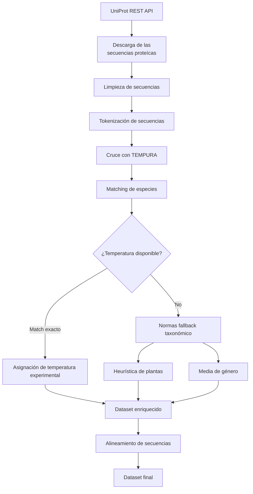

# Datasets

## Overview

El acceso abierto a datos científicos de calidad ha transformado la forma en que se desarrolla la investigación. Gracias a iniciativas como UniProt y otras bases de datos públicas, hoy es posible que investigadores independientes, estudiantes y pequeños grupos de trabajo puedan desarrollar proyectos de alto impacto sin depender necesariamente de los recursos de grandes instituciones o empresas. La ciencia abierta no solo favorece la reproducibilidad y la transparencia, sino que también democratiza el acceso al conocimiento y acelera la innovación al permitir que cualquier persona pueda construir sobre el trabajo previo de la comunidad científica.

Este proyecto nace precisamente aprovechando esa filosofía. Su objetivo es explorar hasta qué punto es posible predecir distintas propiedades fisicoquímicas de la enzima **RuBisCO** utilizando exclusivamente la información contenida en su secuencia primaria y otros metadatos biológicos asociados. Aunque el primer caso de estudio se centra en la predicción de la temperatura óptima de actividad, la arquitectura del proyecto está diseñada para extenderse en el futuro a otras propiedades de interés biotecnológico.

Para ello se emplean dos tipos principales de información. Por un lado, las secuencias proteicas de RuBisCO, que constituyen la principal fuente de información sobre la estructura y función potencial de la proteína. Por otro, metadatos biológicos, principalmente información taxonómica de los organismos que expresan cada proteína y datos experimentales, que permiten asociar cada secuencia con la propiedad objetivo que se desea modelar, en este caso la **temperatura óptima de actividad**.

Actualmente, el conjunto de datos se construye a partir de la integración de información procedente de **UniProt** y **TEMPURA**. No obstante, el proyecto está concebido como una plataforma en evolución, por lo que en futuras versiones podrán incorporarse nuevas fuentes de datos —como anotaciones funcionales, información estructural o bases de datos especializadas— con el objetivo de ampliar las capacidades predictivas y mejorar el rendimiento de los modelos.

## Fuentes de datos

### UniProt

**UniProt** es una de las bases de datos de proteínas más completas y ampliamente utilizadas por la comunidad científica. Proporciona secuencias proteicas revisadas y anotaciones biológicas de alta calidad, convirtiéndose en una fuente de referencia para estudios de bioinformática, biología molecular y aprendizaje automático aplicado a proteínas.

En este proyecto, UniProt constituye la fuente principal de información. A partir de ella se obtienen las secuencias de **RuBisCO**, junto con la información necesaria para identificar de forma unívoca cada proteína y relacionarla con el organismo del que procede.

Los campos actualmente utilizados son:

| Campo | Descripción |
|:------|:------------|
|Entry |	Identificador único de UniProt para cada proteína.|
|Protein names	| Nombre anotado de la proteína. |
|Organism	| Organismo del que procede la secuencia. |
|Taxonomic lineage	| Clasificación taxonómica completa del organismo.|
|Temperature dependence	| Anotaciones experimentales relacionadas con la dependencia de temperatura, cuando están disponibles.|
|Sequence	| Secuencia primaria de aminoácidos utilizada como entrada principal de los modelos.|

Aunque el proyecto almacena todos estos campos, la información más relevante durante esta primera fase corresponde a la **secuencia proteica**, el **organismo** y su **linaje taxonómico**, ya que permiten relacionar posteriormente cada proteína con información experimental procedente de otras fuentes.

### TEMPURA

**TEMPURA** (Database of Growth TEMPERatures of Usual and Rare Prokaryotes) es una base de datos que recopila temperaturas de crecimiento determinadas experimentalmente para microorganismos, principalmente bacterias y arqueas.

Mientras que UniProt proporciona información sobre las proteínas, TEMPURA aporta un tipo de información complementaria que resulta esencial para este proyecto: las condiciones térmicas en las que viven los organismos de los que proceden dichas proteínas.

Mediante la información taxonómica compartida entre ambas bases de datos, las secuencias de RuBisCO obtenidas desde UniProt pueden enriquecerse con la temperatura media de crecimiento registrada experimentalmente para cada organismo. Esta temperatura se utiliza en la fase actual del proyecto como aproximación a la temperatura óptima de funcionamiento de la proteína y constituye la variable objetivo de los modelos de predicción.

Además de la temperatura media, el proceso de integración conserva también las temperaturas mínima y máxima registradas para cada organismo. Aunque estos valores todavía no participan en el entrenamiento de los modelos, se almacenan con el objetivo de facilitar futuras líneas de investigación y permitir el desarrollo de nuevos enfoques predictivos.

### Integraciones futuras

Uno de los objetivos a largo plazo del proyecto es enriquecer progresivamente el conjunto de datos incorporando nuevas fuentes de información biológica.

Entre las posibles integraciones futuras se encuentra **AlphaFold DB**, cuya incorporación permitiría complementar la secuencia primaria con información estructural tridimensional predicha mediante inteligencia artificial. La inclusión de características derivadas de la estructura podría mejorar la capacidad predictiva de determinados modelos y abrir nuevas líneas de investigación centradas en la relación entre estructura y función proteica.

No obstante, la incorporación de este tipo de información supone importantes retos computacionales y metodológicos, por lo que, por el momento, el proyecto se centra exclusivamente en información derivada de la secuencia primaria y de los metadatos biológicos asociados.

A medida que el proyecto evolucione también se valorará la incorporación de otras bases de datos especializadas que permitan añadir anotaciones funcionales, estructurales o evolutivas, ampliando así el alcance de los modelos desarrollados.

## ¿Porqué estos datasets?

La elección de **UniProt** y **TEMPURA** responde tanto a criterios científicos como a principios de reproducibilidad y accesibilidad.

Desde un punto de vista técnico, ambas bases de datos aportan información altamente complementaria. UniProt proporciona secuencias proteicas cuidadosamente curadas y una extensa anotación biológica, mientras que TEMPURA incorpora datos experimentales sobre las condiciones térmicas de crecimiento de bacterias y arqueas. La integración de ambas fuentes permite construir un conjunto de datos consistente para estudiar la relación entre la secuencia primaria de RuBisCO y sus propiedades funcionales.

Al mismo tiempo, estas bases de datos representan un excelente ejemplo del valor de la ciencia abierta. Su disponibilidad pública permite que investigadores, estudiantes y desarrolladores de cualquier parte del mundo puedan acceder a información de alta calidad sin depender de infraestructuras o recursos exclusivos de grandes organizaciones. Esta accesibilidad favorece la reproducibilidad de los resultados, facilita la validación independiente de los modelos y reduce las barreras de entrada para nuevas iniciativas de investigación.

Este proyecto es, en gran medida, posible gracias a ese esfuerzo colectivo por compartir datos científicos de forma abierta. Del mismo modo, toda la metodología desarrollada aquí pretende ser transparente y reproducible para que cualquier persona interesada pueda comprenderla, replicarla y utilizarla como punto de partida para nuevas investigaciones.

## Construcción del dataset

El conjunto de datos utilizado en este proyecto no procede de una única fuente, sino que se construye mediante un proceso de integración y enriquecimiento de datos procedentes de diferentes bases públicas. El objetivo es obtener un dataset consistente que combine la información de secuencia proporcionada por UniProt con información experimental sobre temperatura procedente de TEMPURA, aplicando posteriormente distintos procesos de limpieza, normalización y preparación para su utilización por los modelos de aprendizaje automático.

## Preprocesamiento

Una vez descargados los datos desde las distintas fuentes, se aplica un proceso de preprocesamiento cuyo objetivo es construir un conjunto de datos consistente, reproducible y adecuado para el entrenamiento de los modelos de aprendizaje automático. Este proceso se compone de las siguientes etapas:

### 1. Descarga de secuencias

La primera fase consiste en la obtención automática de secuencias de RuBisCO desde la API REST de UniProt.

* Se realiza una búsqueda específica de proteínas RuBisCO utilizando tanto el nombre del gen (rbcL) como diferentes anotaciones de la proteína, ampliando la consulta para incluir variantes presentes en arqueas, especialmente especies termófilas e hipertermófilas.

* La descarga se realiza de forma paginada para recuperar grandes volúmenes de información de manera eficiente y respetando las limitaciones de la API.

* Una vez finalizada la descarga, se eliminan registros duplicados mediante el identificador único de UniProt (Entry), conservando únicamente una entrada por proteína.

### 2. Limpieza y preparación de secuencias

Antes de utilizar las secuencias como entrada de los modelos, se aplican varias transformaciones destinadas a garantizar la calidad y homogeneidad de los datos.

* Se eliminan todas aquellas entradas que no contienen una secuencia proteica válida, evitando incorporar muestras incompletas durante el entrenamiento.

* Las secuencias se normalizan eliminando espacios, saltos de línea y otros caracteres de formato que puedan haberse introducido durante el proceso de descarga.

* Finalmente, cada aminoácido se separa mediante espacios, generando una representación tokenizada compatible con modelos basados en transformadores, como ESM-2.

### 3. Enriquecimiento del conjunto de datos

Las secuencias obtenidas desde UniProt se complementan con información experimental procedente de TEMPURA para incorporar la variable objetivo utilizada por los modelos.

* Se normalizan previamente los nombres científicos de los organismos con el fin de facilitar el cruce entre ambas bases de datos y minimizar discrepancias derivadas del formato de escritura.

* Cuando existe una coincidencia exacta entre especies, se asignan las temperaturas mínima, óptima y máxima registradas experimentalmente en TEMPURA.

* Aunque en esta primera fase únicamente se utiliza la temperatura óptima como variable objetivo, también se almacenan las temperaturas mínima y máxima para facilitar futuras ampliaciones del proyecto.

### 4. Estrategia jerárquica de asignación

No todas las especies presentes en UniProt disponen de información experimental en TEMPURA. Para aumentar la cobertura del conjunto de datos sin recurrir a asignaciones arbitrarias, se implementa una estrategia jerárquica basada en criterios biológicos.

* La prioridad siempre es asignar la temperatura experimental correspondiente a la especie exacta cuando esta se encuentra disponible.

* En el caso de organismos pertenecientes a Viridiplantae o Streptophyta, donde TEMPURA presenta una cobertura limitada, se asigna inicialmente un rango térmico conservador basado en las condiciones habituales de crecimiento de plantas fotosintéticas. Esta aproximación permite mantener estas secuencias en el conjunto de datos hasta disponer de información experimental más específica.

* Cuando una especie no aparece en TEMPURA, se intenta recuperar la información a nivel de género utilizando los valores medios registrados para dicho grupo taxonómico.

* Si ninguna de estas estrategias permite asignar una temperatura con suficiente confianza, la secuencia permanece sin etiquetar y queda excluida del entrenamiento supervisado.

### 5. Alineamiento de secuencias

Como etapa final del preprocesamiento, las secuencias pueden alinearse respecto a una referencia común antes de emplearse en determinados modelos.

* El alineamiento se realiza mediante algoritmos de alineamiento por pares utilizando la matriz de sustitución BLOSUM62 y penalizaciones configurables para la apertura y extensión de huecos (gaps).

* Tras el alineamiento, todas las secuencias presentan una longitud uniforme, facilitando la comparación entre posiciones homólogas y la extracción de características dependientes de la posición.

* La implementación también contempla la posibilidad de emplear algoritmos de alineamiento múltiple mediante herramientas externas como Clustal Omega o MAFFT, permitiendo adaptar el flujo de trabajo a distintos enfoques experimentales sin modificar el resto del pipeline.

## Dataset statistics

| Métrica                            |   Valor |
|:-----------------------------------|--------:|
| Número de proteínas                |  2000   |
| Número de organismos               |  1184   |
| Número de géneros                  |   708   |
| Número de dominios taxonómicos     |     4   |
| Longitud media de secuencia (aa)   |   448.8 |
| Longitud mediana de secuencia (aa) |   461   |
| Longitud mínima (aa)               |    16   |
| Longitud máxima (aa)               |  5902   |
| Temperatura óptima media (°C)      |    52.9 |
| Temperatura óptima mínima (°C)     |    20   |
| Temperatura óptima máxima (°C)     |   105   |

La tabla anterior resume las principales características del conjunto de datos utilizado en esta primera fase del proyecto. Tras el proceso de integración y preprocesamiento se dispone de **2.000 secuencias de RuBisCO**, pertenecientes a **1.184 organismos** distribuidos en **708 géneros** y **cuatro dominios taxonómicos**, proporcionando una representación amplia de la diversidad evolutiva presente en este tipo de enzimas.

Las secuencias presentan una **longitud media de 448,8 aminoácidos**, muy próxima a la mediana (461 aminoácidos), lo que sugiere una distribución relativamente homogénea para la mayor parte del conjunto de datos. No obstante, también se observan algunos valores extremos, con secuencias significativamente más cortas o largas que la longitud habitual de una RuBisCO, cuya influencia será analizada en los apartados posteriores mediante el estudio de la distribución y la detección de posibles valores atípicos.

En cuanto a la variable objetivo, las **temperaturas óptimas** abarcan un amplio rango experimental, **desde 20 °C hasta 105 °C, con una media de 52,9 °C**. Esta variabilidad resulta especialmente interesante desde el punto de vista del aprendizaje automático, ya que permite entrenar modelos sobre proteínas adaptadas a condiciones ambientales muy diferentes, incluyendo organismos mesófilos, termófilos e hipertermófilos.

### Estadisticas de las secuencias

| Estadístico          |   Valor |
|:---------------------|--------:|
| Número de secuencias | 2000    |
| Media                |  448.8  |
| Mediana              |  461    |
| Desviación estándar  |  280.02 |
| Mínimo               |   16    |
| Percentil 25         |  376.75 |
| Percentil 75         |  476    |
| Percentil 95         |  743.25 |
| Máximo               | 5902    |

La longitud de las secuencias constituye una característica de gran relevancia tanto desde el punto de vista biológico como computacional. Las diferencias en el número de aminoácidos pueden reflejar la existencia de distintas formas de RuBisCO, proteínas de fusión, secuencias parciales o posibles anomalías de anotación, además de influir directamente en las estrategias de preprocesamiento y representación empleadas por los modelos de aprendizaje automático.

Las 2.000 secuencias analizadas presentan una longitud media de 448,8 aminoácidos y una mediana de 461 aminoácidos, valores muy próximos entre sí que indican que la mayor parte del conjunto de datos se concentra alrededor de la longitud esperada para las proteínas RuBisCO. Asimismo, el 50 % de las secuencias se sitúa entre 376,8 y 476 aminoácidos, lo que refleja una elevada homogeneidad en la distribución principal del conjunto de datos.

No obstante, la desviación estándar (280 aminoácidos) y el amplio rango observado, desde 16 hasta 5.902 aminoácidos, evidencian la presencia de un reducido número de valores extremos. El histograma completo muestra cómo la distribución está claramente dominada por unas pocas secuencias excepcionalmente largas, mientras que el diagrama de cajas confirma la existencia de numerosos valores atípicos, especialmente en el extremo superior de la distribución.

Para facilitar una interpretación más representativa del conjunto de datos, también se presenta un histograma limitado al percentil 99. Esta visualización elimina el efecto de las secuencias más extremas y permite apreciar con mayor claridad que la inmensa mayoría de las proteínas poseen una longitud inferior a aproximadamente 1.300 aminoácidos, concentrándose principalmente alrededor de los 450 aminoácidos.

Aunque estas secuencias atípicas no se eliminan automáticamente del conjunto de datos, su identificación resulta fundamental para futuras fases del proyecto, ya que serán objeto de un análisis individual con el fin de determinar si corresponden a proteínas de fusión, anotaciones incompletas, variantes biológicamente relevantes o posibles errores de anotación en las bases de datos de origen.

### Estadísticas de temperatura

## Train / Validation / Test split

## Biases and limitations

## Licensing

## Reproductibility

## Future improvements
