# Datasets

## Overview

El acceso abierto a datos científicos de calidad ha transformado la forma en que se desarrolla la investigación. Gracias a iniciativas como UniProt y otras bases de datos públicas, hoy es posible que investigadores independientes, estudiantes y pequeños grupos de trabajo puedan desarrollar proyectos de alto impacto sin depender necesariamente de los recursos de grandes instituciones o empresas. La ciencia abierta no solo favorece la reproducibilidad y la transparencia, sino que también democratiza el acceso al conocimiento y acelera la innovación al permitir que cualquier persona pueda construir sobre el trabajo previo de la comunidad científica.

Este proyecto nace precisamente aprovechando esa filosofía. Su objetivo es explorar hasta qué punto es posible predecir distintas propiedades fisicoquímicas de la enzima **RuBisCO** utilizando exclusivamente la información contenida en su secuencia primaria y otros metadatos biológicos asociados. Aunque el primer caso de estudio se centra en la predicción de la temperatura óptima de actividad, la arquitectura del proyecto está diseñada para extenderse en el futuro a otras propiedades de interés biotecnológico.

Para ello se emplean dos tipos principales de información. Por un lado, las secuencias proteicas de RuBisCO, que constituyen la principal fuente de información sobre la estructura y función potencial de la proteína. Por otro, metadatos biológicos, principalmente información taxonómica de los organismos que expresan cada proteína y datos experimentales, que permiten asociar cada secuencia con la propiedad objetivo que se desea modelar, en este caso la **temperatura óptima de actividad**.

Actualmente, el conjunto de datos se construye a partir de la integración de información procedente de **UniProt** y **TEMPURA**. No obstante, el proyecto está concebido como una plataforma en evolución, por lo que en futuras versiones podrán incorporarse nuevas fuentes de datos —como anotaciones funcionales, información estructural o bases de datos especializadas— con el objetivo de ampliar las capacidades predictivas y mejorar el rendimiento de los modelos.

## Fuentes de datos

### UniProt

**UniProt** es una de las bases de datos de proteínas más completas y ampliamente utilizadas por la comunidad científica. Proporciona secuencias proteicas revisadas y anotaciones biológicas de alta calidad, convirtiéndose en una fuente de referencia para estudios de bioinformática, biología molecular y aprendizaje automático aplicado a proteínas.

En este proyecto, UniProt constituye la fuente principal de información. A partir de ella se obtienen las secuencias de **RuBisCO**, junto con la información necesaria para identificar de forma unívoca cada proteína y relacionarla con el organismo del que procede.

Los campos actualmente utilizados son:

| Campo | Descripción |
|:------|:------------|
|Entry |	Identificador único de UniProt para cada proteína.|
|Protein names	| Nombre anotado de la proteína. |
|Organism	| Organismo del que procede la secuencia. |
|Taxonomic lineage	| Clasificación taxonómica completa del organismo.|
|Temperature dependence	| Anotaciones experimentales relacionadas con la dependencia de temperatura, cuando están disponibles.|
|Sequence	| Secuencia primaria de aminoácidos utilizada como entrada principal de los modelos.|

Aunque el proyecto almacena todos estos campos, la información más relevante durante esta primera fase corresponde a la **secuencia proteica**, el **organismo** y su **linaje taxonómico**, ya que permiten relacionar posteriormente cada proteína con información experimental procedente de otras fuentes.

### TEMPURA

**TEMPURA** (Database of Growth TEMPERatures of Usual and Rare Prokaryotes) es una base de datos que recopila temperaturas de crecimiento determinadas experimentalmente para microorganismos, principalmente bacterias y arqueas.

Mientras que UniProt proporciona información sobre las proteínas, TEMPURA aporta un tipo de información complementaria que resulta esencial para este proyecto: las condiciones térmicas en las que viven los organismos de los que proceden dichas proteínas.

Mediante la información taxonómica compartida entre ambas bases de datos, las secuencias de RuBisCO obtenidas desde UniProt pueden enriquecerse con la temperatura media de crecimiento registrada experimentalmente para cada organismo. Esta temperatura se utiliza en la fase actual del proyecto como aproximación a la temperatura óptima de funcionamiento de la proteína y constituye la variable objetivo de los modelos de predicción.

Además de la temperatura media, el proceso de integración conserva también las temperaturas mínima y máxima registradas para cada organismo. Aunque estos valores todavía no participan en el entrenamiento de los modelos, se almacenan con el objetivo de facilitar futuras líneas de investigación y permitir el desarrollo de nuevos enfoques predictivos.

### Integraciones futuras

Uno de los objetivos a largo plazo del proyecto es enriquecer progresivamente el conjunto de datos incorporando nuevas fuentes de información biológica.

Entre las posibles integraciones futuras se encuentra **AlphaFold DB**, cuya incorporación permitiría complementar la secuencia primaria con información estructural tridimensional predicha mediante inteligencia artificial. La inclusión de características derivadas de la estructura podría mejorar la capacidad predictiva de determinados modelos y abrir nuevas líneas de investigación centradas en la relación entre estructura y función proteica.

No obstante, la incorporación de este tipo de información supone importantes retos computacionales y metodológicos, por lo que, por el momento, el proyecto se centra exclusivamente en información derivada de la secuencia primaria y de los metadatos biológicos asociados.

A medida que el proyecto evolucione también se valorará la incorporación de otras bases de datos especializadas que permitan añadir anotaciones funcionales, estructurales o evolutivas, ampliando así el alcance de los modelos desarrollados.

## ¿Porqué estos datasets?

La elección de **UniProt** y **TEMPURA** responde tanto a criterios científicos como a principios de reproducibilidad y accesibilidad.

Desde un punto de vista técnico, ambas bases de datos aportan información altamente complementaria. UniProt proporciona secuencias proteicas cuidadosamente curadas y una extensa anotación biológica, mientras que TEMPURA incorpora datos experimentales sobre las condiciones térmicas de crecimiento de bacterias y arqueas. La integración de ambas fuentes permite construir un conjunto de datos consistente para estudiar la relación entre la secuencia primaria de RuBisCO y sus propiedades funcionales.

Al mismo tiempo, estas bases de datos representan un excelente ejemplo del valor de la ciencia abierta. Su disponibilidad pública permite que investigadores, estudiantes y desarrolladores de cualquier parte del mundo puedan acceder a información de alta calidad sin depender de infraestructuras o recursos exclusivos de grandes organizaciones. Esta accesibilidad favorece la reproducibilidad de los resultados, facilita la validación independiente de los modelos y reduce las barreras de entrada para nuevas iniciativas de investigación.

Este proyecto es, en gran medida, posible gracias a ese esfuerzo colectivo por compartir datos científicos de forma abierta. Del mismo modo, toda la metodología desarrollada aquí pretende ser transparente y reproducible para que cualquier persona interesada pueda comprenderla, replicarla y utilizarla como punto de partida para nuevas investigaciones.

## Construcción del dataset

El conjunto de datos utilizado en este proyecto no procede de una única fuente, sino que se construye mediante un proceso de integración y enriquecimiento de datos procedentes de diferentes bases públicas. El objetivo es obtener un dataset consistente que combine la información de secuencia proporcionada por UniProt con información experimental sobre temperatura procedente de TEMPURA, aplicando posteriormente distintos procesos de limpieza, normalización y preparación para su utilización por los modelos de aprendizaje automático.

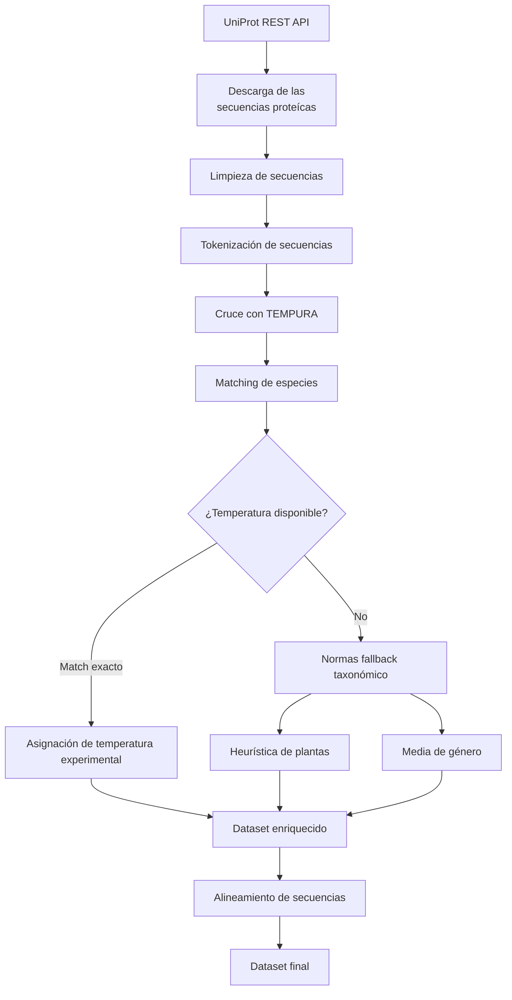

## Preprocesamiento

Una vez descargados los datos desde las distintas fuentes, se aplica un proceso de preprocesamiento cuyo objetivo es construir un conjunto de datos consistente, reproducible y adecuado para el entrenamiento de los modelos de aprendizaje automático. Este proceso se compone de las siguientes etapas:

### 1. Descarga de secuencias

La primera fase consiste en la obtención automática de secuencias de RuBisCO desde la API REST de UniProt.

* Se realiza una búsqueda específica de proteínas RuBisCO utilizando tanto el nombre del gen (rbcL) como diferentes anotaciones de la proteína, ampliando la consulta para incluir variantes presentes en arqueas, especialmente especies termófilas e hipertermófilas.

* La descarga se realiza de forma paginada para recuperar grandes volúmenes de información de manera eficiente y respetando las limitaciones de la API.

* Una vez finalizada la descarga, se eliminan registros duplicados mediante el identificador único de UniProt (Entry), conservando únicamente una entrada por proteína.

### 2. Limpieza y preparación de secuencias

Antes de utilizar las secuencias como entrada de los modelos, se aplican varias transformaciones destinadas a garantizar la calidad y homogeneidad de los datos.

* Se eliminan todas aquellas entradas que no contienen una secuencia proteica válida, evitando incorporar muestras incompletas durante el entrenamiento.

* Las secuencias se normalizan eliminando espacios, saltos de línea y otros caracteres de formato que puedan haberse introducido durante el proceso de descarga.

* Finalmente, cada aminoácido se separa mediante espacios, generando una representación tokenizada compatible con modelos basados en transformadores, como ESM-2.

### 3. Enriquecimiento del conjunto de datos

Las secuencias obtenidas desde UniProt se complementan con información experimental procedente de TEMPURA para incorporar la variable objetivo utilizada por los modelos.

* Se normalizan previamente los nombres científicos de los organismos con el fin de facilitar el cruce entre ambas bases de datos y minimizar discrepancias derivadas del formato de escritura.

* Cuando existe una coincidencia exacta entre especies, se asignan las temperaturas mínima, óptima y máxima registradas experimentalmente en TEMPURA.

* Aunque en esta primera fase únicamente se utiliza la temperatura óptima como variable objetivo, también se almacenan las temperaturas mínima y máxima para facilitar futuras ampliaciones del proyecto.

### 4. Estrategia jerárquica de asignación

No todas las especies presentes en UniProt disponen de información experimental en TEMPURA. Para aumentar la cobertura del conjunto de datos sin recurrir a asignaciones arbitrarias, se implementa una estrategia jerárquica basada en criterios biológicos.

* La prioridad siempre es asignar la temperatura experimental correspondiente a la especie exacta cuando esta se encuentra disponible.

* En el caso de organismos pertenecientes a Viridiplantae o Streptophyta, donde TEMPURA presenta una cobertura limitada, se asigna inicialmente un rango térmico conservador basado en las condiciones habituales de crecimiento de plantas fotosintéticas. Esta aproximación permite mantener estas secuencias en el conjunto de datos hasta disponer de información experimental más específica.

* Cuando una especie no aparece en TEMPURA, se intenta recuperar la información a nivel de género utilizando los valores medios registrados para dicho grupo taxonómico.

* Si ninguna de estas estrategias permite asignar una temperatura con suficiente confianza, la secuencia permanece sin etiquetar y queda excluida del entrenamiento supervisado.

### 5. Alineamiento de secuencias

Como etapa final del preprocesamiento, las secuencias pueden alinearse respecto a una referencia común antes de emplearse en determinados modelos.

* El alineamiento se realiza mediante algoritmos de alineamiento por pares utilizando la matriz de sustitución BLOSUM62 y penalizaciones configurables para la apertura y extensión de huecos (gaps).

* Tras el alineamiento, todas las secuencias presentan una longitud uniforme, facilitando la comparación entre posiciones homólogas y la extracción de características dependientes de la posición.

* La implementación también contempla la posibilidad de emplear algoritmos de alineamiento múltiple mediante herramientas externas como Clustal Omega o MAFFT, permitiendo adaptar el flujo de trabajo a distintos enfoques experimentales sin modificar el resto del pipeline.

## Dataset statistics

| Métrica                            |   Valor |
|:-----------------------------------|--------:|
| Número de proteínas                |  2000   |
| Número de organismos               |  1184   |
| Número de géneros                  |   708   |
| Número de dominios taxonómicos     |     4   |
| Longitud media de secuencia (aa)   |   448.8 |
| Longitud mediana de secuencia (aa) |   461   |
| Longitud mínima (aa)               |    16   |
| Longitud máxima (aa)               |  5902   |
| Temperatura óptima media (°C)      |    52.9 |
| Temperatura óptima mínima (°C)     |    20   |
| Temperatura óptima máxima (°C)     |   105   |

La tabla anterior resume las principales características del conjunto de datos utilizado en esta primera fase del proyecto. Tras el proceso de integración y preprocesamiento se dispone de **2.000 secuencias de RuBisCO**, pertenecientes a **1.184 organismos** distribuidos en **708 géneros** y **cuatro dominios taxonómicos**, proporcionando una representación amplia de la diversidad evolutiva presente en este tipo de enzimas.

Las secuencias presentan una **longitud media de 448,8 aminoácidos**, muy próxima a la mediana (461 aminoácidos), lo que sugiere una distribución relativamente homogénea para la mayor parte del conjunto de datos. No obstante, también se observan algunos valores extremos, con secuencias significativamente más cortas o largas que la longitud habitual de una RuBisCO, cuya influencia será analizada en los apartados posteriores mediante el estudio de la distribución y la detección de posibles valores atípicos.

En cuanto a la variable objetivo, las **temperaturas óptimas** abarcan un amplio rango experimental, **desde 20 °C hasta 105 °C, con una media de 52,9 °C**. Esta variabilidad resulta especialmente interesante desde el punto de vista del aprendizaje automático, ya que permite entrenar modelos sobre proteínas adaptadas a condiciones ambientales muy diferentes, incluyendo organismos mesófilos, termófilos e hipertermófilos.

### Estadisticas de las secuencias

| Estadístico          |   Valor |
|:---------------------|--------:|
| Número de secuencias | 2000    |
| Media                |  448.8  |
| Mediana              |  461    |
| Desviación estándar  |  280.02 |
| Mínimo               |   16    |
| Percentil 25         |  376.75 |
| Percentil 75         |  476    |
| Percentil 95         |  743.25 |
| Máximo               | 5902    |

La longitud de las secuencias constituye una característica de gran relevancia tanto desde el punto de vista biológico como computacional. Las diferencias en el número de aminoácidos pueden reflejar la existencia de distintas formas de RuBisCO, proteínas de fusión, secuencias parciales o posibles anomalías de anotación, además de influir directamente en las estrategias de preprocesamiento y representación empleadas por los modelos de aprendizaje automático.

Las 2.000 secuencias analizadas presentan una longitud media de 448,8 aminoácidos y una mediana de 461 aminoácidos, valores muy próximos entre sí que indican que la mayor parte del conjunto de datos se concentra alrededor de la longitud esperada para las proteínas RuBisCO. Asimismo, el 50 % de las secuencias se sitúa entre 376,8 y 476 aminoácidos, lo que refleja una elevada homogeneidad en la distribución principal del conjunto de datos.

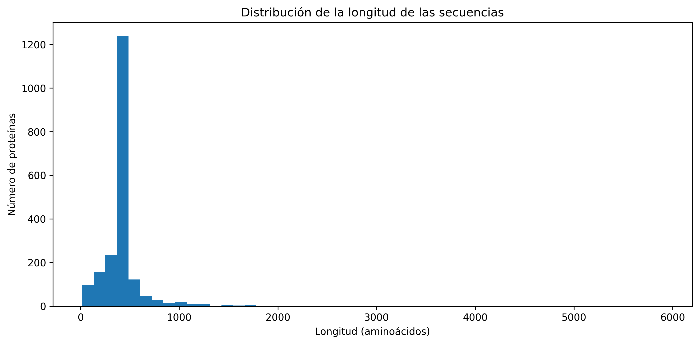

No obstante, la desviación estándar (280 aminoácidos) y el amplio rango observado, desde 16 hasta 5.902 aminoácidos, evidencian la presencia de un reducido número de valores extremos. El histograma completo muestra cómo la distribución está claramente dominada por unas pocas secuencias excepcionalmente largas, mientras que el diagrama de cajas confirma la existencia de numerosos valores atípicos, especialmente en el extremo superior de la distribución.

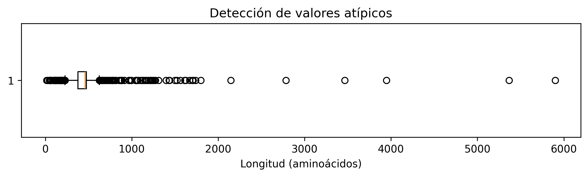

Para facilitar una interpretación más representativa del conjunto de datos, también se presenta un histograma limitado al percentil 99. Esta visualización elimina el efecto de las secuencias más extremas y permite apreciar con mayor claridad que la inmensa mayoría de las proteínas poseen una longitud inferior a aproximadamente 1.300 aminoácidos, concentrándose principalmente alrededor de los 450 aminoácidos.

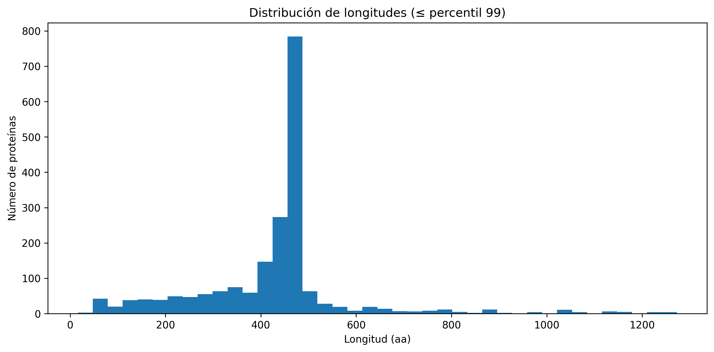

Aunque estas secuencias atípicas no se eliminan automáticamente del conjunto de datos, su identificación resulta fundamental para futuras fases del proyecto, ya que serán objeto de un análisis individual con el fin de determinar si corresponden a proteínas de fusión, anotaciones incompletas, variantes biológicamente relevantes o posibles errores de anotación en las bases de datos de origen.

### Estadísticas de temperatura

La temperatura óptima de funcionamiento constituye la variable objetivo de esta primera fase del proyecto. A partir de la información taxonómica obtenida de TEMPURA fue posible asignar un valor experimental de temperatura óptima a **1.686** de las **2.000** secuencias recopiladas, que conforman el conjunto utilizado para el entrenamiento y evaluación de los modelos.

| Estadístico             |   Valor |
|:------------------------|--------:|
| Número de observaciones | 1686    |
| Media                   |   52.93 |
| Mediana                 |   28.2  |
| Desviación estándar     |   30.77 |
| Mínimo                  |   20    |
| Percentil 25            |   25    |
| Percentil 75            |   85    |
| Percentil 95            |  100    |
| Máximo                  |  105    |

Los valores abarcan un **amplio rango**, desde **20 °C** hasta **105 °C**, reflejando la enorme diversidad de nichos ecológicos en los que habitan los organismos que contienen RuBisCO. La mediana se sitúa en **28,2 °C**, mientras que la media asciende a **52,9 °C**, una diferencia considerable que evidencia que la distribución no es simétrica y está fuertemente influenciada por organismos adaptados a temperaturas elevadas.

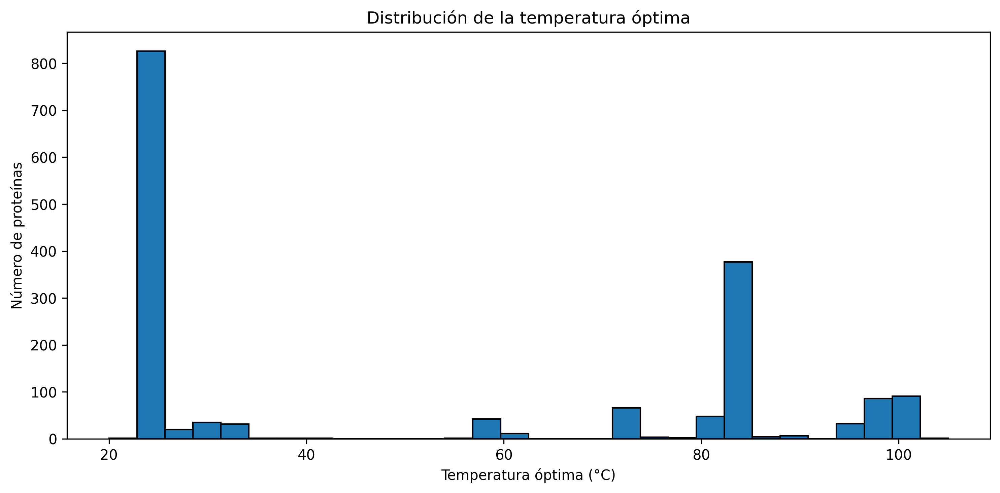

El histograma confirma que la distribución presenta varios picos claramente diferenciados, en lugar de seguir una distribución aproximadamente normal. Destaca una elevada concentración de organismos con temperaturas óptimas cercanas a 25 °C, correspondiente principalmente a especies mesófilas, junto con un segundo grupo muy numeroso situado entre 80 y 90 °C, característico de arqueas termófilas e hipertermófilas. También aparecen agrupaciones menores alrededor de 60 °C, 70 °C y próximas a 100 °C, reflejando la diversidad de estrategias adaptativas presentes en la naturaleza.

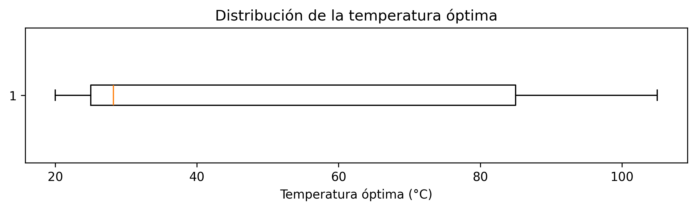

El diagrama de cajas complementa esta información mostrando una gran dispersión de los datos. A diferencia de lo observado en la longitud de las secuencias, no se aprecian valores atípicos especialmente extremos; el amplio rango de temperaturas forma parte de la propia variabilidad biológica del conjunto de datos.

| Thermal_Group | count | 
|:----------------|--------:| 
| Hipertermófilos | 959 | 
| Mesófilos | 916 | 
| Termófilos | 125 |

Una forma más intuitiva de interpretar la distribución consiste en agrupar las proteínas según la clasificación térmica del organismo del que proceden. El conjunto de datos está dominado por secuencias procedentes de **hipertermófilos (959 proteínas)** y **mesófilos (916 proteínas)**, mientras que los **termófilos (125 proteínas)** representan una fracción considerablemente menor del conjunto.

En este trabajo, los grupos térmicos se han definido a partir de la **temperatura óptima (Topt)** asociada a cada organismo: mesófilos **(<45 °C), termófilos (45–80 °C) e hipertermófilos (≥80 °C)**. Dado que el conjunto de datos no contiene organismos con temperaturas óptimas inferiores a 20 °C, no se identificaron representantes del grupo de los psicrófilos.

Esta distribución explica la naturaleza multimodal observada en las temperaturas óptimas y pone de manifiesto un cierto desequilibrio entre grupos térmicos. En particular, los organismos adaptados a temperaturas extremadamente elevadas y a temperaturas moderadas están ampliamente representados, mientras que las proteínas procedentes de organismos termófilos constituyen una minoría. Este aspecto deberá tenerse en cuenta durante el entrenamiento y la evaluación de los modelos, ya que puede influir en su capacidad para generalizar correctamente sobre regiones menos representadas del espacio de temperaturas.

Este desbalanceo implica que el modelo podría aprender muy bien a predecir temperaturas cercanas a 25 °C y 85 °C, pero probablemente **tendrá dificultades para generalizar en el rango intermedio (45–80 °C)**. Cualquier predicción en este rango deberá ser evaluada con especial cautela, y se recomienda considerar técnicas de remuestreo, ponderación de clases o validación cruzada estratificada durante el entrenamiento.

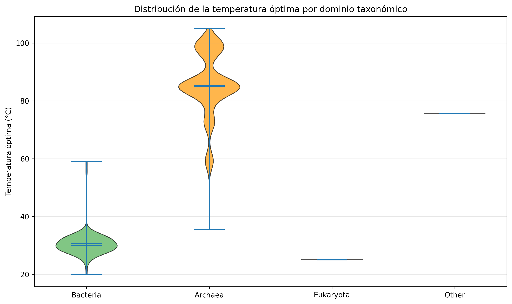

Finalmente, al separar las observaciones por dominio taxonómico se aprecia que la distribución de temperaturas está estrechamente relacionada con la filogenia de los organismos. Las arqueas concentran la mayor parte de las temperaturas elevadas, mientras que las secuencias eucariotas se agrupan casi exclusivamente alrededor de 25 °C. Las bacterias presentan una distribución mucho más amplia, ocupando un rango intermedio que incluye desde organismos psicrófilos hasta termófilos moderados.

Esta fuerte relación entre taxonomía y temperatura confirma la importancia de conservar la información filogenética durante el preprocesamiento, ya que constituye una fuente de información biológicamente relevante para interpretar las propiedades funcionales de las proteínas y puede aportar contexto adicional durante el entrenamiento de futuros modelos.

### Distribución taxonómica

La composición taxonómica del conjunto de datos es un factor determinante para comprender el alcance y las limitaciones de los modelos entrenados. El análisis de los dominios taxonómicos y los géneros más frecuentes revela una estructura de muestreo claramente sesgada hacia organismos con estrategias adaptativas extremas.

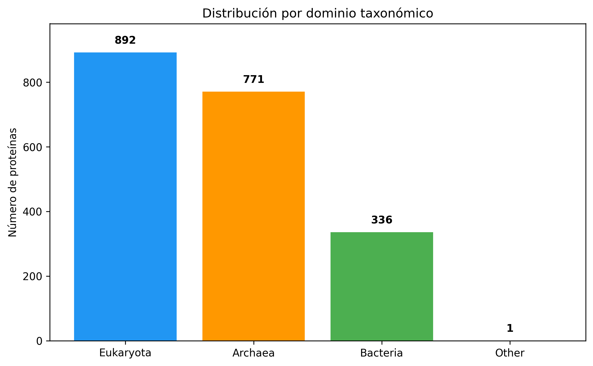

El desglose por dominio taxonómico muestra que las secuencias de **Eukaryota (892 proteínas, 44.6 %)** y **Archaea (771 proteínas, 38.5 %)** son los grupos mayoritarios y están representados de forma casi equitativa. A pesar de la inmensa diversidad y relevancia ecológica de **Bacteria**, este dominio contribuye con **336 proteínas (16.8 %)** y, junto con un único registro clasificado como Other, completa el total de 2.000 secuencias.

Esta distribución es especialmente relevante cuando se contrasta con la información térmica presentada anteriormente. La gran cantidad de secuencias de Eukaryota (principalmente plantas y algas) explica el pico de temperaturas óptimas en torno a los 25 °C, mientras que la abundante presencia de Archaea es la responsable directa del segundo pico alrededor de los 85 °C. El dominio Bacteria, aunque menos numeroso, actúa como un puente térmico que aporta la variabilidad en el rango intermedio (termófilo), aunque en menor proporción.

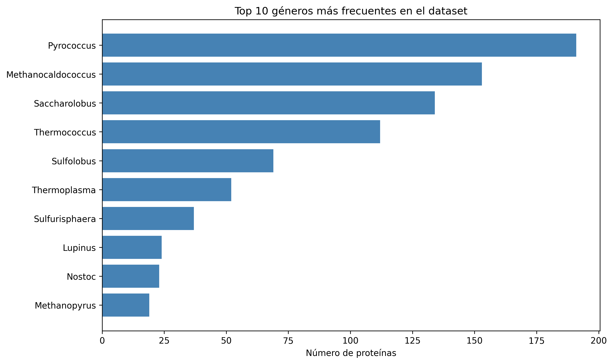

El análisis de los **10 géneros más frecuentes** confirma aún más este patrón. El conjunto de datos está dominado casi por completo por géneros de **arqueas hipertermófilas y termófilas**, como *Pyrococcus* (~190 secuencias), *Methanocaldococcus* (~155), *Saccharolobus* (~135) o *Thermococcus* (~110), entre otros. Esta sobrerrepresentación de arqueas extremófilas es una consecuencia directa del cruce con la base de datos TEMPURA, la cual posee una cobertura históricamente alta para microorganismos de ambientes geotérmicos.

*Lupinus* y *Nostoc* son los únicos representantes eucariotas y bacterianos que logran aparecer en el top 10, probablemente debido a una alta frecuencia de anotaciones en UniProt o a esfuerzos de secuenciación específicos. La presencia de *Nostoc* también añade una interesante diversidad evolutiva, ya que se trata de **cianobacterias** capaces de realizar fijación de nitrógeno y fotosíntesis.

Esta distribución taxonómica tiene consecuencias directas en el rendimiento de los modelos de aprendizaje automático. El fuerte sesgo hacia los extremos térmicos (mesófilos e hipertermófilos) y la infrarrepresentación de los termófilos intermedios (que apenas representan 125 secuencias) sugiere que los modelos podrían tener una **menor capacidad de generalización en el rango de 45–80 °C**. Si bien el conjunto de datos es amplio y diverso para los rangos bajo y alto, cualquier predicción para organismos termófilos moderados debe ser interpretada con cautela.

### Análisis de valores ausentes

Uno de los aspectos críticos para el entrenamiento de modelos supervisados es la disponibilidad de la variable objetivo. Tras el proceso de cruce con TEMPURA, **314 de las 2.000 secuencias (15,7 %)** no pudieron ser etiquetadas con una temperatura óptima. El análisis de estos registros revela que la gran mayoría corresponden a **organismos eucariotas** (principalmente plantas y algas) y a **bacterias** no termófilas. 

Esta falta de cobertura es una limitación inherente a la naturaleza de TEMPURA, una base de datos especializada en procariotas de ambientes extremos. Por lo tanto, el conjunto de datos final utilizado para el entrenamiento (1.686 muestras) está ligeramente sobrerrepresentado por organismos procariotas, lo cual debe tenerse en cuenta al interpretar los resultados.

### Relación entre longitud de secuencia y temperatura

Un análisis exploratorio adicional consiste en estudiar si existe alguna relación entre la longitud de las proteínas RuBisCO y la temperatura óptima del organismo que las expresa.

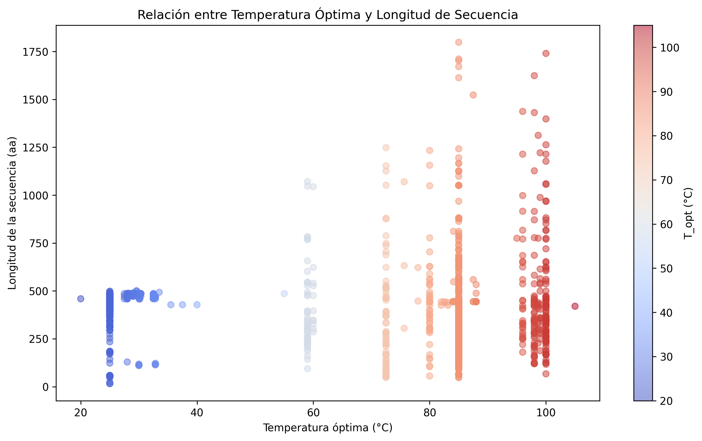

El gráfico de dispersión revela varios patrones interesantes. En primer lugar, se observa una **elevada densidad de puntos en el rango de 400 a 500 aminoácidos**, que se mantiene constante a lo largo de todo el espectro de temperaturas. Esto indica que la longitud canónica de la proteína RuBisCO se conserva independientemente del nicho térmico del organismo. Las "columnas" verticales que se aprecian en el eje de temperaturas son un artefacto de los valores discretos de temperatura registrados en la base de datos TEMPURA.

Lo más destacado del gráfico es la **asimetría en la dispersión hacia longitudes mayores**. Mientras que los organismos mesófilos (representados en azul, T_opt < 45 °C) apenas presentan secuencias que superen los 500 aminoácidos, los organismos hipertermófilos (en rojo, T_opt ≥ 80 °C) muestran una **larga cola de valores atípicos**, con múltiples secuencias que superan los 1.000 e incluso los 1.800 aminoácidos. Esto sugiere que las proteínas de fusión o las variantes estructurales extendidas son un fenómeno casi exclusivo de arqueas adaptadas a ambientes extremos.

### Distribución de la longitud por dominio taxonómico

Al desglosar la longitud de las secuencias por dominio, se aprecian diferencias significativas en la estructura de los datos.

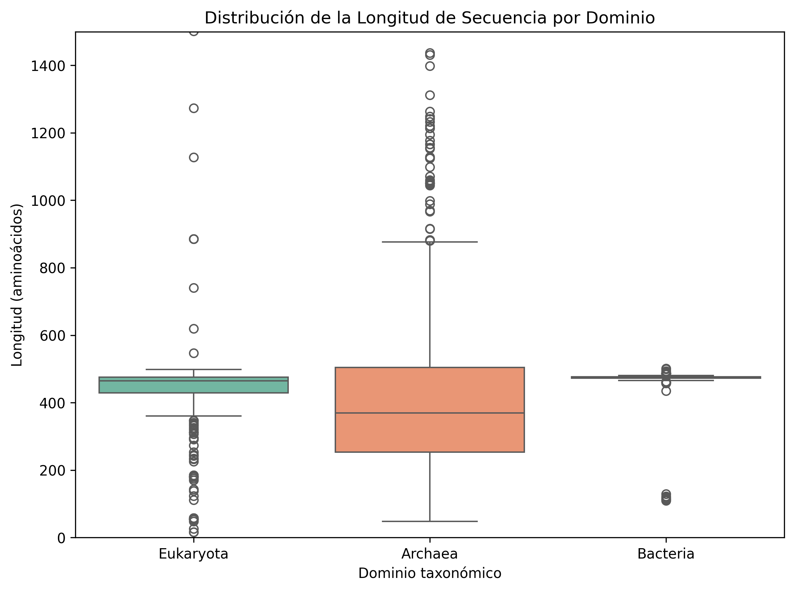

El boxplot (con el eje Y limitado a 1.500 aa para apreciar la caja central) muestra diferencias notables:

*   **Eukaryota:** Presenta la distribución más homogénea. La caja es extremadamente estrecha, con una mediana muy próxima a los **450 aminoácidos**. Apenas unos pocos valores atípicos superan los 600 aa. Esto refleja la alta estabilidad evolutiva de la RuBisCO en el cloroplasto de plantas y algas.
*   **Bacteria:** Su comportamiento es similar al de los eucariotas, con una caja muy ajustada y una mediana en torno a los **470 aminoácidos**. Presenta algunos valores atípicos a la baja, posiblemente debidos a fragmentos de secuencia o anotaciones incompletas.
*   **Archaea:** Este dominio es el principal responsable de la variabilidad observada en el conjunto de datos. Su mediana es sensiblemente inferior, situándose alrededor de los **380 aminoácidos**, pero su rango intercuartílico (el tamaño de la caja) es mucho más amplio. Sobre todo, destaca por la **enorme cantidad de outliers superiores**, que se extienden hasta más allá de los 1.400 aminoácidos (y que en el conjunto global alcanzan los 5.902 aa). Esta variabilidad extrema es consistente con la presencia de proteínas de fusión y dominios adicionales en arqueas termófilas e hipertermófilas.

En conjunto, el scatter plot del apartado anterior y el boxplot confirman que, aunque la mayoría de las secuencias siguen el patrón canónico de ~450 aminoácidos, el **sesgo hacia arqueas hipertermófilas** es el que introduce la mayor parte de la variabilidad y los valores atípicos en la distribución de longitudes.

## Train / Validation / Test split

La correcta partición del conjunto de datos es un paso crítico para garantizar la evaluación objetiva de los modelos y evitar el sobreajuste. En este proyecto, se han implementado dos estrategias de división diferentes, adaptadas a la naturaleza de cada arquitectura de modelo.

### Proporciones y semilla aleatoria

Tanto para los modelos basados en ensemble como para la red neuronal convolucional (CNN), se ha empleado una división **80/20** entre el conjunto de entrenamiento y el de evaluación.

Para garantizar la reproducibilidad de los experimentos, se fijó una semilla aleatoria común (`random_state = 42`) en todas las funciones de partición. Esta decisión asegura que, al re-ejecutar el pipeline de entrenamiento, se obtengan exactamente los mismos subconjuntos de datos para entrenar y evaluar los modelos.

### Estratificación

Debido al **fuerte desbalanceo entre clases térmicas** identificado en la sección de análisis de datos (con una clara infrarrepresentación de los organismos termófilos), la simple división aleatoria podría haber producido conjuntos de prueba desequilibrados. Para mitigar este problema, se implementó una estrategia de estratificación personalizada en la función `stratified_split_simple` del módulo `train_predict.py`.

Esta estrategia consiste en:

1. **Agrupación por rangos térmicos:** Se dividen las temperaturas óptimas en cinco categorías (bins): `0-20°C`, `20-40°C`, `40-60°C`, `60-80°C` y `80-100°C`.

2. **División proporcional por grupo:** Dentro de cada categoría, las muestras se mezclan aleatoriamente y se extrae un porcentaje fijo (test_size = 0.2) para formar parte del conjunto de test, garantizando que todas las categorías térmicas estén representadas en la evaluación en la misma proporción que en el conjunto original.

3. **Fallback de seguridad:** En el caso improbable de que alguna categoría contenga menos de 2 muestras (lo que haría imposible la estratificación), el sistema recurre automáticamente a una división aleatoria simple para evitar errores.

Cabe destacar que, para el entrenamiento del modelo **CNN posicional** (`5_Positional_training.ipynb`), no se aplicó esta estratificación, sino que se utilizó una división aleatoria simple mediante train_test_split de scikit-learn, dado que el objetivo principal era monitorizar la curva de pérdida para aplicar early stopping.

### Prevención del Data Leakage

El **data leakage** (fuga de información) es uno de los errores más comunes en el desarrollo de modelos, y ocurre cuando información del conjunto de test se filtra al proceso de entrenamiento. Para evitarlo, se han seguido las siguientes buenas prácticas en el pipeline:

* **Partición antes del entrenamiento:** La división de los datos en conjuntos disjuntos se realiza antes de iniciar el ciclo de entrenamiento. Esto garantiza que ninguna secuencia o embedding utilizado para ajustar los pesos del modelo haya sido visto durante la evaluación.

* **Escalado de características (SVR):** En el caso específico del modelo SVR, el `StandardScaler` se ajusta (*fit*) exclusivamente sobre los datos de entrenamiento (`X_train`). Posteriormente, esa misma transformación se aplica a `X_test` utilizando el método `.transform()`, evitando que los parámetros de normalización se vean influenciados por los datos de evaluación.

* **Independencia del alineamiento:** Para el modelo posicional, el alineamiento de secuencias se realiza sobre la totalidad del conjunto de datos. Sin embargo, dado que se trata de un **alineamiento por pares** contra una referencia fija (no un alineamiento múltiple progresivo que dependa de otras secuencias), la información posicional de cada secuencia es independiente del resto. Por lo tanto, el proceso de alineamiento no introduce fuga de información entre los conjuntos de train y test.

### Validación Cruzada Interna

Un aspecto adicional a destacar es que, para los modelos clásicos (Random Forest, Gradient Boosting, SVR y Ensemble), el conjunto de entrenamiento (el 80% de los datos) se sometió a una validación cruzada de 5 folds (5-CV). Esta técnica divide el conjunto de entrenamiento en 5 subconjuntos, entrenando el modelo en 4 de ellos y validando en el restante de forma iterativa. Esto proporciona una estimación mucho más robusta del rendimiento del modelo durante el desarrollo, antes de realizar la evaluación final sobre el 20% de test completamente aislado.

## Sesgos y limitaciones

A pesar de los esfuerzos por construir un conjunto de datos amplio y representativo, el proceso de integración entre UniProt y TEMPURA, unido a la naturaleza de la propia literatura científica, introduce una serie de sesgos sistemáticos que deben ser reconocidos antes de interpretar el rendimiento de los modelos. Estos sesgos no invalidan el estudio, pero sí acotan el alcance de sus conclusiones y determinan los escenarios en los que los modelos pueden generalizar con confianza.

### Sesgo taxonómico (Dominio y Género)

El análisis de la composición taxonómica ha revelado una distribución de dominios que se aleja de la diversidad biológica real.

Sobrerrepresentación de Eukaryota y Archaea: Las secuencias de plantas y algas (Eukaryota, 892 proteínas) y de arqueas termófilas (Archaea, 771 proteínas) constituyen conjuntamente el 83 % del dataset.

Infrarrepresentación de Bacteria: A pesar de que las bacterias representan la mayor parte de la diversidad procariota y son responsables de gran parte de la fijación de carbono en ecosistemas marinos y terrestres, solo contribuyen con 336 proteínas (16,8 %).

A nivel de género, el sesgo es aún más extremo. El dataset está dominado por géneros de arqueas hipertermófilas (Pyrococcus, Methanocaldococcus, Saccharolobus, Thermococcus), que acumulan la mayor parte de las secuencias. Lupinus (plantas) y Nostoc (cianobacterias) son los únicos representantes no arqueanos que logran colarse en el top 10.

Implicación: Los modelos tendrán una capacidad de generalización mucho mayor para predecir la temperatura de plantas y arqueas hipertermófilas que para bacterias mesófilas o termófilas.

### Sesgo térmico (El "missing middle")

El desequilibrio taxonómico se traduce directamente en un fuerte desbalanceo en la variable objetivo. La distribución de temperaturas óptimas es claramente bimodal, con dos picos principales:

Mesófilos (< 45 °C): 916 proteínas.

Hipertermófilos (≥ 80 °C): 959 proteínas.

Termófilos (45–80 °C): Tan solo 125 proteínas.

Esta marcada infrarrepresentación del rango intermedio (entre 45 °C y 80 °C) tiene implicaciones críticas para el aprendizaje automático. Aunque la función de pérdida (MSE) promediará los errores, los modelos tenderán a optimizar su rendimiento en los rangos bajo y alto, donde hay abundancia de datos, a costa de un peor desempeño en el rango intermedio.

### Sesgo de muestreo y publicación (Publication Bias)

La fuente de los datos, principalmente la literatura científica curada en UniProt y las mediciones experimentales de TEMPURA, introduce un sesgo de publicación inevitable.

* **Modelos biológicos clásicos:** Eukaryota está sobrerrepresentada porque la RuBisCO de plantas (como *Arabidopsis* o *Spinacia*) es uno de los modelos más estudiados en fisiología vegetal y bioquímica.

* **Interés biotecnológico:** Las arqueas hipertermófilas (como *Pyrococcus* o *Thermococcus*) son extremadamente populares en biotecnología debido a sus enzimas termoestables, lo que explica la enorme cantidad de secuencias depositadas en UniProt.

* **Menor atención a bacterias mesófilas/termófilas:** Muchas bacterias ambientales, a pesar de su importancia ecológica, han sido menos secuenciadas y estudiadas en el contexto de la termoestabilidad de sus proteínas, lo que explica su infrarrepresentación en este dataset.

Este sesgo implica que los resultados de este estudio son particularmente relevantes para organismos modelo y de interés biotecnológico, pero podrían no extrapolarse con la misma precisión a la diversidad bacteriana menos caracterizada.

### Sesgo de datos faltantes (Missing Data)

Como se mencionó en el análisis de valores ausentes, **314 de las 2.000 secuencias (15,7 %)** no pudieron ser etiquetadas con una temperatura óptima tras el cruce con TEMPURA. El análisis cualitativo de estos registros indica que la gran mayoría corresponden a **organismos eucariotas** (principalmente algas y plantas no modelo) y a **bacterias** no termófilas.

La ausencia de estos datos tiene un doble efecto:

1. **Reduce el tamaño muestral** ya limitado para el rango intermedio de temperaturas.

2. **Refuerza el sesgo taxonómico**, ya que las muestras perdidas pertenecen en su mayoría a los grupos ya infrarrepresentados (Bacteria y Eucariotas no modelo), exacerbando la dominancia de las arqueas hipertermófilas en el conjunto de entrenamiento final.

### Implicaciones para el rendimiento de los modelos

La combinación de los sesgos descritos tiene consecuencias directas en el rendimiento esperado de los modelos entrenados (Random Forest, Ensemble y CNN posicional):

* **Alta precisión en los extremos:** Se espera que los modelos predigan con gran precisión temperaturas en torno a 25 °C (plantas) y 85–100 °C (arqueas hipertermófilas), ya que son las regiones mejor muestreadas.

* **Baja fiabilidad en el rango medio (45–80 °C):** Cualquier predicción en el rango termófilo debe interpretarse con extrema cautela. Los modelos carecen de ejemplos suficientes para aprender las relaciones estructura-función específicas de este nicho térmico.

* **Dependencia del grupo taxonómico:** Los modelos probablemente aprenderán a inferir la temperatura a partir de patrones filogenéticos (por ejemplo, si una secuencia es de una arquea, predecir alta temperatura; si es de una planta, predecir baja temperatura) en lugar de aprender propiedades fisicoquímicas intrínsecas de la secuencia. Esto es un riesgo de shortcut learning (atajo) que debe ser evaluado en experimentos de validación cruzada con taxones excluidos.

**Conclusión de las limitaciones:** Este dataset es una herramienta excelente para explorar la relación entre secuencia y estabilidad térmica en **organismos modelo y extremófilos**, pero no es un conjunto representativo de toda la diversidad de la enzima RuBisCO en la naturaleza. Las conclusiones extraídas de los modelos deben ser consideradas como **hipótesis biológicas robustas dentro de estos nichos ecológicos**, en lugar de leyes universales aplicables a cualquier organismo.

## Licensing

El respeto por los términos de uso de las fuentes de datos y la propiedad intelectual es un pilar fundamental de este proyecto. Aunque el objetivo es desarrollar un flujo de trabajo reproducible, se ha prestado especial atención a no infringir las licencias de las bases de datos utilizadas.

### UniProt

**UniProt** se distribuye bajo la licencia **Creative Commons Attribution-NoDerivatives (CC BY-ND 4.0)**. Esto permite a los usuarios utilizar, descargar y redistribuir libremente los datos, siempre que se atribuya correctamente la fuente y no se modifiquen las anotaciones originales.
En este proyecto, la obtención de datos se realiza exclusivamente a través de la API REST pública de UniProt, cumpliendo estrictamente con sus términos de servicio y políticas de uso. Todas las secuencias descargadas se utilizan únicamente con fines de investigación no comercial.

### TEMPURA

**TEMPURA** (Database of Growth TEMPERatures of Usual and Rare Prokaryotes) está sujeta a una **licencia académica específica**. Aunque su uso con fines de investigación está generalmente permitido, la **redistribución directa del conjunto de datos original está restringida** por sus términos de uso.

### Política de redistribución y acceso a los datos

Para garantizar el cumplimiento de las licencias mencionadas, este proyecto adopta las siguientes prácticas:

* **No redistribución de datos originales:** El repositorio del proyecto **no incluye, ni ha incluido en ningún momento, copias de los datasets originales** de TEMPURA o de las descargas masivas desde UniProt.

* **Flujo de trabajo basado en scripts:** Toda la construcción del dataset se realiza mediante scripts que actúan sobre las APIs públicas. De esta forma, cualquier investigador que desee replicar el estudio puede hacerlo utilizando las mismas fuentes de datos, manteniendo la trazabilidad y evitando la distribución de materiales sujetos a derechos de autor.

* **Documentación de los métodos:** Se proporcionan instrucciones claras sobre cómo configurar el entorno y ejecutar el proceso de descarga y preprocesamiento.

### Código fuente y documentación

Como parte de la estrategia de ciencia abierta, la **documentación generada** (incluyendo este archivo descriptivo, las estadísticas del dataset y la metodología de preprocesamiento) se comparte públicamente para garantizar la transparencia y la reproducibilidad de los resultados.

Sin embargo, el **código fuente interno** del pipeline de descarga y procesamiento es de carácter privado, tal como se ha establecido en los objetivos iniciales del proyecto. Los scripts de descarga se documentan conceptualmente en esta guía, permitiendo a otros investigadores comprender el proceso sin necesidad de acceder al código subyacente. Esto equilibra la protección de la propiedad intelectual con el compromiso de compartir el conocimiento y la metodología con la comunidad científica.

## Reproductibility

A pesar de que el código fuente del pipeline de integración y procesamiento es de carácter privado, este proyecto está diseñado bajo un firme compromiso con la **reproducibilidad metodológica**. Cualquier investigador o estudiante con conocimientos intermedios de Python y bioinformática puede replicar los resultados presentados en este estudio siguiendo el protocolo detallado a continuación.

Para garantizar la reproducibilidad, se han seguido las mejores prácticas en cuanto al registro de versiones, trazabilidad de los datos y especificación del entorno. El flujo de trabajo se puede dividir en las siguientes etapas perfectamente documentadas:

### Entorno y dependencias
El desarrollo se ha llevado a cabo utilizando Python 3.10.20. Las bibliotecas esenciales y sus versiones específicas para garantizar la compatibilidad son las siguientes (extraídas del archivo requirements.txt del proyecto):

`pandas==2.2.3`

`numpy==1.26.4`

`scikit-learn==1.6.1`

`torch==2.5.1` (con soporte CUDA 12.1 a través del índice de PyTorch)

`transformers==4.48.3`

`biopython==1.87`

`h5py==3.16.0`

`matplotlib==3.9.3`

`seaborn==0.13.2`

`requests==2.32.3`

`joblib==1.4.2`

`tqdm==4.67.1`

`plotly==6.9.0`

!!! note "Nota"
    Para el entrenamiento del modelo posicional en Google Colab, se recomienda instalar las versiones específicas de `torch` con soporte CUDA tal como se detalla en el notebook `5_Positional_training.ipynb`. El archivo `requirements.txt` del proyecto incluye comentarios detallados para la instalación correcta en función de la versión de CUDA disponible en el sistema (11.8, 12.1, 12.4, etc.).

### Adquisición y trazabilidad de los datos originales

Para replicar la construcción del dataset, se deben obtener las siguientes fuentes en sus fechas de acceso originales:

* **UniProt (descarga de secuencias):**

    * Fecha de acceso: **30 de junio de 2026**.

    * Script utilizado: `src/utils/download_data.py`.

    * Endpoint de la API: `https://rest.uniprot.org/uniprotkb/search`.

    * Parámetros de la consulta: La función `descargar_secuencias_uniprot` ejecuta una búsqueda compuesta que combina el gen `rbcL`, el nombre de la proteína ("Ribulose bisphosphate carboxylase"), términos específicos para arqueas termófilas (*Pyrococcus*, *Thermococcus*, etc.) y la búsqueda explícita de "RuBisCO type III".

    * El proceso descargó, limpió y eliminó duplicados basándose en el identificador `Entry`.

* **TEMPURA (cruces taxonómicos):**

    * Fecha de acceso/versión descargada: **30 de junio de 2026** (archivo `200617_TEMPURA.csv`).

    * La base de datos se utilizó exclusivamente para enriquecer las secuencias con los valores `T_min`, `T_opt` y `T_max`.

### Protocolo de preprocesamiento y limpieza

El conjunto de datos final (2.000 secuencias) se construyó siguiendo rigurosamente el siguiente pipeline, que ha sido documentado conceptualmente en la sección Construcción del dataset de esta guía y codificado en los scripts `src/utils/data_enricher.py` y `src/utils/download_data.py`:

1. **Limpieza inicial:** Normalización de caracteres y eliminación de espacios en las secuencias mediante la función limpiar_y_tokenizar.

2. **Tokenización:** Separación de cada aminoácido por un espacio para la compatibilidad con ESM-2 (Tokenized_Sequence).

3. **Asignación de temperatura (Estrategia Jerárquica):**

    * **Prioridad 1:** Cruce exacto por especie con TEMPURA (basado en genus_and_species).

    * **Prioridad 2:** Para organismos clasificados como Viridiplantae o Streptophyta sin coincidencia exacta, asignación de un rango térmico conservador (`T_min=5.0`, `T_opt=25.0`, `T_max=35.0`).

    * **Prioridad 3:** Asignación por temperatura media del género cuando la especie no está disponible, utilizando la agrupación por género de TEMPURA.

4. **Eliminación de registros no válidos:** Filtrado de muestras sin una `T_opt` asignada (314 registros descartados para el entrenamiento supervisado).

5. ** Alineamiento (para modelos posicionales):** Alineamiento por pares utilizando la clase `SequenceAligner` de `src/utils/alignment_utils.py`, con matriz `BLOSUM62` y una longitud fija recortada a 1000 posiciones (tal como se implementa en `5_Positional_training.ipynb`) para controlar el uso de memoria y garantizar la uniformidad.

6. **División estratificada:** Partición Train/Test 80/20 con semilla fija (`random_state = 42`) y estratificación manual basada en rangos de temperatura (`0-20`, `20-40`, `40-60`, `60-80`, `80-100` °C) para garantizar la representación de todos los nichos térmicos en el conjunto de evaluación.

### Infraestructura y tiempos de ejecución

Para replicar los resultados con tiempos de ejecución similares, se recomienda la siguiente infraestructura. El tiempo total del pipeline completo es de aproximadamente **45–60 minutos** en hardware estándar de gama media-alta.

* **Extracción de embeddings (ESM-2 `t6_8M`):** Entorno con GPU NVIDIA T4 (en Google Colab) o superior. Tiempo estimado: **~15 minutos** para 2.000 secuencias.

* **Entrenamiento del modelo Ensemble (Random Forest, SVR, GBR):** CPU moderna (8+ núcleos). Tiempo estimado: **~2 minutos**.

* **Entrenamiento del modelo CNN posicional:** GPU NVIDIA T4. Tiempo estimado: **~10 minutos** para 100 épocas.

La ejecución de este protocolo, siguiendo exactamente los pasos y parámetros aquí descritos, debería conducir a un conjunto de datos con las mismas métricas estadísticas (distribución de longitudes, dominios y temperaturas) y un rendimiento de modelos análogo al presentado en este estudio.

## Mejoras Futuras

Si bien el dataset actual y los modelos desarrollados han demostrado ser una prueba de concepto sólida para predecir la temperatura óptima de RuBisCO a partir de su secuencia, existen numerosas vías de mejora que permitirían ampliar el alcance del proyecto, reducir los sesgos identificados y aumentar la precisión de las predicciones.

### Expansión y diversificación del dataset

La principal limitación del conjunto de datos actual es el fuerte sesgo taxonómico y térmico. Para abordarlo, las futuras iteraciones deberían centrarse en:

* **Aumentar la representación bacteriana:** Dado que las bacterias representan solo el 16,8 % del dataset actual, una prioridad será ampliar la búsqueda en UniProt para incluir una mayor diversidad de filos bacterianos, especialmente aquellos que habitan en rangos de temperatura mesófilos y termófilos moderados.

* **Reducir el "missing middle":** La infrarrepresentación de organismos termófilos (45–80 °C) limita la capacidad de generalización en este rango crítico. Se podría explorar el uso de bases de datos complementarias a TEMPURA, como **BacDive** o **NCBI BioSample**, que ofrecen información térmica de crecimiento para un espectro más amplio de microorganismos.

* **Integración de proteínas no canónicas:** Actualmente el dataset se centra en la subunidad grande (rbcL). La inclusión de la subunidad pequeña (rbcS) o de isoformas menos estudiadas de RuBisCO podría enriquecer el espacio de características y revelar nuevos patrones de estabilidad térmica.

### Caracterización estructural y funcional

Una de las vías más prometedoras es la incorporación de información estructural. Aunque el proyecto se ha centrado exclusivamente en la secuencia primaria, el futuro podría traer:

* **Integración con AlphaFold DB:** Añadir embeddings estructurales (por ejemplo, utilizando los modelos de Evoformer) como características adicionales. La estructura tridimensional de una proteína está íntimamente relacionada con su estabilidad térmica, por lo que esta información podría aumentar significativamente la precisión de los modelos.

* **Anotaciones funcionales y de interacción:** Enriquecer el dataset con anotaciones de UniProt relativas a modificaciones post-traduccionales, sitios de unión a cofactores o dominios proteicos adicionales.

### Mejora de los modelos de aprendizaje automático

La arquitectura de los modelos también puede ser objeto de una evolución significativa:

* **Modelos fundacionales más grandes**: Actualmente se utiliza el modelo ESM-2 `t6_8M` (8 millones de parámetros) por su eficiencia computacional. Futuras iteraciones podrían evaluar modelos más profundos y de mayor capacidad, como el `esm2_t36_3B_UR50D` (3.000 millones de parámetros), que capturan representaciones semánticas mucho más ricas de las secuencias proteicas.

* **Aprendizaje multitarea:** En lugar de predecir únicamente la `T_opt`, se podría entrenar el modelo para predecir simultáneamente `T_min`, `T_opt` y `T_max`. Esto no solo aprovecharía toda la información disponible, sino que forzaría al modelo a aprender relaciones más complejas entre la secuencia y el espectro térmico completo del organismo.

* **Modelos basados en atención (Transformers):** El modelo 1D-CNN posicional ya es un gran avance, pero se podría implementar un **Transformer encoder** directamente sobre los embeddings posicionales, permitiendo que el modelo aprenda relaciones de largo alcance entre residuos distantes, un factor clave en la estabilidad de proteínas termófilas.

### Validación experimental (Benchmarking)

La validación final de cualquier modelo predictivo en biología debe ser experimental. A medio plazo, se plantea:

* **Colaboración con laboratorios húmedos:** Seleccionar un conjunto de proteínas de RuBisCO cuyas temperaturas óptimas hayan sido predichas por el modelo con alta confianza (y otras con baja confianza) y validarlas experimentalmente mediante ensayos de actividad enzimática a diferentes temperaturas.

* **Análisis de mutaciones _in silico_:** Utilizar el modelo posicional para identificar qué residuos específicos contribuyen más a la estabilidad térmica y simular mutaciones puntuales para predecir cómo afectarían a la `T_opt`.

Estas mejoras, aunque ambiciosas, son perfectamente alcanzables y permitirían evolucionar el proyecto desde una prueba de concepto hasta una herramienta de predicción robusta y de referencia para la biotecnología de enzimas termoestables.