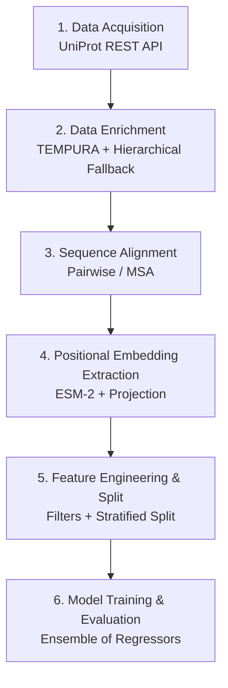

# Methodology

The complete implementation of this pipeline is available in the companion **[code repository](https://github.com/amicosa/Ruby-project)**. 
This section provides a conceptual and algorithmic overview of the entire workflow, from raw sequence retrieval to the final predictive model.

---

## 📊 Pipeline Overview

The methodology is structured as a sequential pipeline with six main phases:

___

### 1. Data Acquisition (UniProt)

**Objective:** Retrieve a diverse and curated set of RuBisCO sequences, with special emphasis on thermophilic archaea.

**Implementation details** (`download_data.py`):

* Query design: The script builds a complex Boolean query targeting:

    * The gene name (`rbcL`) and protein name ("Ribulose bisphosphate carboxylase").

    * Explicit terms for archaea (e.g., *Archaea*, *Pyrococcus*, *Sulfolobus*) to ensure thermal diversity.

    * Type III RuBisCO variants, which are characteristic of archaea.

* **Pagination:** Uses UniProt's cursor-based pagination to handle large result sets (up to 2,000 records per run) without overwhelming the API.

* **Output:** Raw TSV containing metadata (organism, lineage, sequence) and a tokenized version of the sequence (space-separated amino acids) for downstream ESM-2 compatibility.

**Rationale:** RuBisCO is highly conserved but spans all domains of life. Including hyperthermophilic archaea ensures our dataset covers a wide T_opt range (5 °C to >100 °C), which is critical for training a robust regression model.

---

### 2. Data Enrichment (Thermal Parameters)

**Objective:** Assign experimentally-derived or biologically-plausible thermal parameters (`T_min`, `T_opt`, `T_max`) to each sequence.

**Implementation details** (`data_enricher.py`):

We employ a **hierarchical fallback strategy** to maximize the number of sequences with thermal labels:

1. Exact species match (TEMPURA database):
The primary source is TEMPURA, a curated database of prokaryotic growth temperatures. We merge on `genus_and_species` (standardized to lower case).

2. Plant lineage fallback:
If a sequence lacks TEMPURA data but belongs to Viridiplantae or Streptophyta (green plants), we assign a default photosynthetic optimum:
`T_min = 5.0`, `T_opt = 25.0`, `T_max = 35.0`.

3. Genus-level fallback:
If the exact species is not found, we aggregate TEMPURA data at the genus level (mean `T_opt` per genus) and use that average as a proxy.

4. Unassigned:
Sequences that fail all three rules are discarded from the modeling dataset (though they remain in the raw archive).

**Rationale:** This hierarchical approach is a pragmatic balance between data quantity and quality. While exact TEMPURA matches are ideal, the genus-level and plant fallbacks allow us to retain ecologically relevant sequences that would otherwise be lost.

---

### 3. Sequence Alignment

**Objective:** Homogenize sequence lengths to enable positional embedding extraction. This step ensures that homologous residues across different species align to the same index in the final tensor.

Implementation details (alignment_utils.py):

* **Method selection:** The SequenceAligner class supports two modes:

    * **Pairwise (default):** Aligns each sequence against a chosen reference (e.g., the first sequence or a provided canonical sequence) using BioPython's `PairwiseAligner` with BLOSUM62 matrix.

    * **External MSA:** Optionally uses **Clustal Omega** or **MAFFT** for multiple sequence alignment (MSA). If the external tool is missing, it gracefully falls back to pairwise alignment.

* **Gap handling:** All alignments use `-` as the gap character. After alignment, sequences are padded to a uniform length (the maximum alignment length).

* **Output:** A list of strings of equal length, where each position corresponds to a specific column in the multiple alignment.

**Rationale:** Alignments are crucial for our positional embedding strategy. Without alignment, the same amino acid at index 50 in two different sequences would have no biological equivalence. By fixing the alignment, we create a "structural grid" that the model can learn from.

---

### 4. Positional Embedding Extraction (ESM-2)

**Objective:** Convert aligned sequences into dense vector representations while preserving the alignment grid. This is the core innovation of our pipeline.

**Implementation details** (`esm_positional_extractor.py`):

This step is handled by the `ESMPositionalExtractor` class and follows a precise three-stage process:

1. **Strip gaps:** For each aligned sequence, we remove all - characters to obtain the "raw" amino acid sequence (e.g., M-V-L → MVL).

2. **Extract raw embeddings:** The raw sequence is passed through the **ESM-2** model (we use `esm2_t6_8M_UR50D` for initial prototyping, but the architecture supports larger variants). ESM-2 returns a tensor of shape `(L_raw, 768)` where each token (amino acid) is mapped to a 768-dimensional vector.

3. **Project back to alignment:** We create an empty tensor of shape `(L_aligned, 768)` filled with zeros. We then iterate over the aligned sequence:

    * If the character is an amino acid (not a gap), we place the next raw embedding vector into that position.

    * If the character is a gap (`-`), we leave the zero vector.

**Result:** A tensor `X_pos` of shape `(N_samples, L_aligned, 768)`.
Gap positions are represented as zero vectors, effectively masking them.

**Storage:**

* Embeddings are saved in **HDF5** format (`embeddings.h5`) with chunked compression (GZIP). This allows efficient random access and streaming without loading the entire tensor into memory.

* Metadata (fixed_length, embed_dim, model_name) are stored as HDF5 attributes.

**Rationale:**

* Preserves evolutionary/structural context.

* Allows the model to learn which alignment positions are critical for thermal stability.

* Zero-masking handles gaps naturally, avoiding the need for complex padding mechanisms in the downstream regressor.

---

### 5. Feature Engineering and Data Split

**Objective:** Clean the dataset, apply quality filters, and split the data to ensure unbiased evaluation.

**Implementation details** (`train_predict.py`):

**Quality filters** (applied via `prepare_data_with_filters`):

* Remove sequences with `T_opt` outside the range [0, 100] °C.

* Enforce a minimum sequence length of 350 residues unless the organism is an *archaeon* (to preserve thermophilic diversity).

* Classify taxa into *Archaea*, *Plants*, *Bacteria*, or *Otros* based on the taxonomic lineage.

Stratified Split (via stratified_split_simple):
A simple random split would be biased if most mesophilic sequences end up in training and thermophilic ones in test. To prevent this:

* We bin `T_opt` into 5 categories: [0-20), [20-40), [40-60), [60-80), [80-100].

* We perform a **stratified split** (80/20) ensuring each temperature bin is proportionally represented in both training and test sets.

* The function gracefully handles edge cases (e.g., bins with fewer than 2 samples) by falling back to random split with a warning.

**Output:**

`X_train`, `X_test`: Flattened embeddings of shape `(N, L_aligned * 768)` (the positional dimension is flattened into the feature vector).

`y_train`, `y_test`: Corresponding `T_opt` labels.

---

### 6. Modeling and Prediction

**Objective:** Train and compare multiple regression models to predict `T_opt` from the ESM-2 embeddings.

**Implementation details** (`train_predict.py`):

We adopt a **multi-model strategy** to identify the best performer:

| Model | Strengths | Hyperparameter Optimization |
|:---|:---|:---|
|Random Forest |	Handles high-dimensional sparse data well. Robust to outliers. |	GridSearchCV over n_estimators, max_depth, min_samples_split. |
|Gradient Boosting |	Often yields higher accuracy on tabular data. Sequential learning. |	Fixed parameters (n_estimators=200, lr=0.1). |
|SVR (RBF) |	Captures non-linear relationships. |	Requires feature scaling (StandardScaler). Fixed C=10, gamma='scale'. |
|Voting Ensemble |	Combines the three above via averaging. Reduces overfitting. |	Weighted voting (equal weights). |

**Training pipeline** (orchestrated by `train_thermal_predictor_v2`):

1. *Scale features* (only for SVR, but the ensemble automatically handles scaling via the scaler passed to SVR).

2. Train each model independently.

3. Evaluate on the held-out test set using:

    * **RMSE** (Root Mean Squared Error) – primary metric.

    * **R²** (Coefficient of Determination).

    * **MAE** (Mean Absolute Error).

4. Perform **5-fold cross-validation** on the training set for the ensemble to estimate generalization performance.

**Saving:**

The best ensemble and its scaler are serialized using `joblib` and stored in the `../models/` directory for later use in a web app or inference pipeline.

## 🛠️ Tools and Technologies

| Tool/Library | Purpose |
|:-------------|:--------|
|Python 3.9+ | Core language.|
|UniProt REST API | Sequence and metadata retrieval.|
|Pandas / NumPy |	Data manipulation and numerical operations.|
|BioPython  | Pairwise alignment, substitution matrices.|
|Hugging Face Transformers | ESM-2 model loading and inference.|
|PyTorch | Backend for ESM-2 (GPU acceleration).|
|Scikit-learn | Model training, cross-validation, metrics.|
|Joblib | Model serialization.|
|H5Py |	Efficient storage of large embedding tensors.|
|MkDocs (Material) | Documentation framework.|

## 🔄 Reproducibility
To ensure full reproducibility:

All scripts accept explicit paths for inputs and outputs.

Random seeds are fixed (`random_state=42`) across all splitting and training steps.

The exact versions of dependencies will be frozen in a `requirements.txt` (to be added in the code repository).

## 📌 Future Methodological Extensions
While this methodology focuses on supervised regression for `T_opt`, the framework is designed to be extensible:

* **Generative Design:** Using the positional embeddings as conditioning for diffusion models (e.g., EvoDiff) to generate novel RuBisCO sequences.

* **Multi-task Learning:** Predicting additional properties (pH optimum, catalytic rate kcat) simultaneously.

* **Attention Visualization:** Extracting attention maps from ESM-2 to identify residues critical for thermal adaptation (e.g., via Integrated Gradients or attention rollout).
