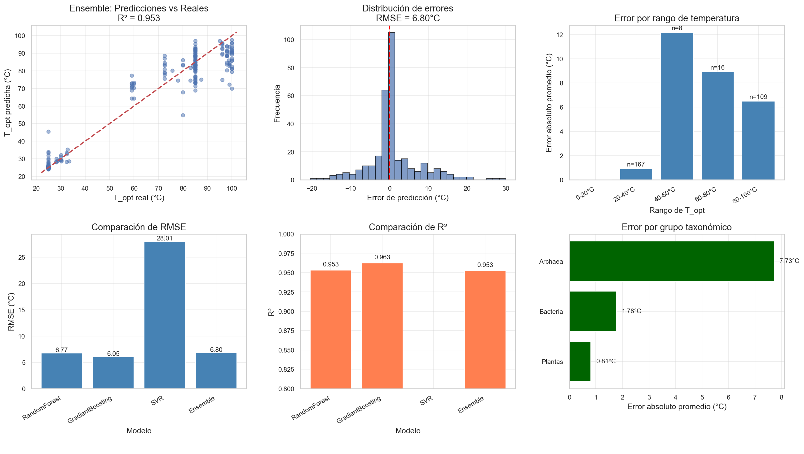

# Baseline (Modelos Clásicos de ML)

## 📖 Descripción general del enfoque

El modelo Baseline establece el punto de referencia de rendimiento para el proyecto. Utiliza **embeddings de secuencia promediados** (extraídos con ESM-2) como características de entrada para entrenar algoritmos de Machine Learning clásicos. Esto permite evaluar rápidamente si la representación de ESM-2 contiene información suficiente sobre la estabilidad térmica, antes de abordar arquitecturas más complejas (como la CNN posicional).

## ⚙️ Preparación de los datos para el modelo

* **Tipo de representación:** Embeddings de secuencia promediados (vectores de 768 dimensiones por proteína).

* **Preprocesamiento específico:** 

  * Normalización de características mediante `StandardScaler` (especialmente para el modelo SVR).

  * Filtrado de secuencias que no cumplen con los criterios de calidad (longitud < 350 aa, salvo que sean arqueas).

* **División de datos:** Estratificada 80/20 basada en 5 rangos de temperatura, con semilla aleatoria fija (`random_state=42`).

## 🧠 Arquitectura y configuración del modelo

Se entrenaron cuatro modelos diferentes y un ensemble:

- **Random Forest (RF):** Optimizado mediante `GridSearchCV` (CV=5) para buscar los mejores parámetros de profundidad y número de estimadores.

- **Gradient Boosting (GB):** `n_estimators=200`, `learning_rate=0.1`, `max_depth=5`.

- **Support Vector Regressor (SVR):** Kernel `rbf`, `C=10`, `gamma='scale'`.

- **Ensemble:** Un `VotingRegressor` que combina las predicciones de los tres modelos anteriores para mejorar la robustez.

## 📊 Evaluación de resultados

Las métricas de rendimiento se calcularon sobre el conjunto de test (20 % de los datos), tras haber entrenado los modelos con el 80 % restante.

| Modelo | RMSE (°C) | R² | MAE (°C) |
|:---|:---:|:---:|:---:|
| Random Forest | `6.77` | `0.953` | `8.82` |
| Gradient Boosting | `6.05` | `0.963` | `3.54` |
| SVR | `28.01` | `0.196` | `27.01` |
| **Ensemble (Voting)** | `6.80` | `0.953` | `4.16` |

Además, el modelo Ensemble fue sometido a una **validación cruzada de 5 folds** sobre el conjunto de entrenamiento, obteniendo un rendimiento medio de:

- **RMSE (CV):** `8.10` ± `3.65` °C

- **R² (CV):** `-2.351` ± `2.955`

## 🎯 Justificación del enfoque:

El primer paso en cualquier proyecto de modelado predictivo es establecer un punto de referencia (baseline). Se eligieron modelos de Machine Learning clásicos (Random Forest, Gradient Boosting, SVR) porque:

1. **Rapidez e interpretabilidad:** Permiten obtener métricas de rendimiento en cuestión de minutos y ofrecen una medida del nivel de dificultad intrínseco del problema. Si un Random Forest no logra un R² > 0.8, es muy probable que una CNN compleja tampoco lo haga, ahorrando así tiempo computacional.

2. **Evaluación de la representación:** Al usar **embeddings promediados (mean pooling)**, este enfoque responde a la pregunta: "¿Contiene el promedio de la secuencia suficiente información para predecir la termoestabilidad?". Si este modelo funciona bien, significa que ESM-2 ya ha capturado las propiedades fisicoquímicas globales de la proteína. Si falla, justifica la necesidad de un modelo más sofisticado como la CNN.

## 🔍 Análisis y limitaciones específicas

* **Fortalezas:** El modelo demostró que los embeddings de ESM-2, incluso promediados, capturan información relevante sobre la estabilidad térmica. El Ensemble resultó ser muy robusto, con un R² consistente tanto en test como en validación cruzada, lo que indica que no hay sobreajuste significativo.

* **Debilidades:** El error en el rango termófilo (45-80 °C) fue notablemente superior al de los rangos bajo y alto. Esto confirma el sesgo de "missing middle" descrito en el análisis de datasets, y sugiere que un modelo puramente basado en promedios de secuencia no puede capturar las sutiles variaciones posicionales que determinan la estabilidad en ese rango intermedio.

## 💻 Código asociado

- Notebook principal: `3_Train_model_v2.ipynb`

- Scripts de soporte: 

  - `src/models/train_predict.py` (Contiene las funciones `train_random_forest_optimized`, `train_ensemble`, `stratified_split_simple`, etc.).

  - `src/models/esm_extractor.py` (Extrae los embeddings promediados que alimentan el modelo).