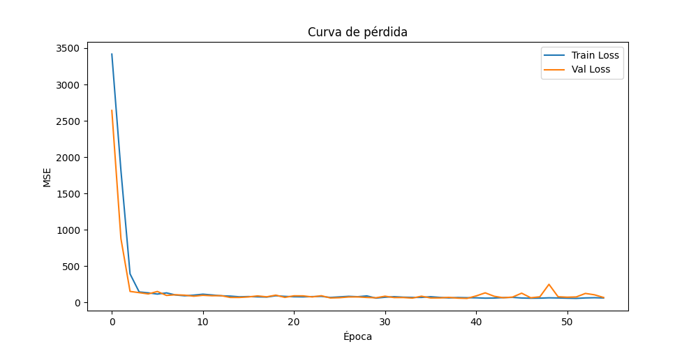
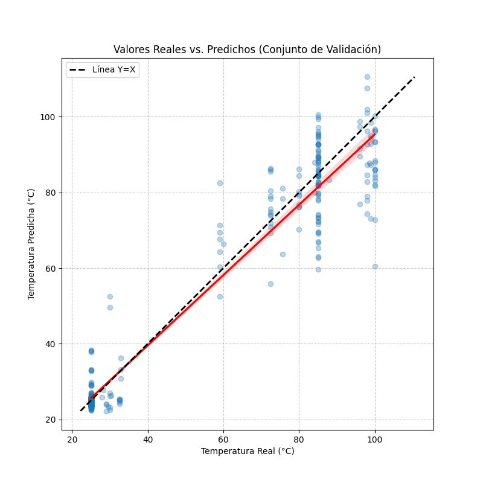

# Positional CNN Model (1D-CNN)

Use the tabs below to switch between English and Spanish.

=== "English"

    ## 📖 General approach description

    The positional CNN model represents the second level of complexity in the project. While the Baseline used **pooled embeddings** (losing all positional information), this approach exploits the **sequential nature of proteins** by using **per-residue embeddings** (token-level).

    To do this, sequences are first aligned against a common reference, and ESM-2 embeddings are projected onto that alignment. This enables a **1D Convolutional Neural Network (1D-CNN)** to learn local motifs and short-range patterns directly related to enzyme thermal stability.

    ## ⚙️ Data preparation for the model

    * **Representation type:** Positional embeddings (per residue). A three-dimensional matrix of shape `(N, L_fixed, 768)`, where `N` is the number of samples, `L_fixed` is the alignment length, and `768` is the embedding dimension of ESM-2 (`t6_8M`).

    * **Specific preprocessing:**

      * **Pairwise alignment:** Raw sequences are aligned against a reference (the first sequence in the dataset) using the BioPython algorithm with the `BLOSUM62` matrix.

      * **Length truncation (`MAX_LENGTH = 1000`):** To control memory usage and standardize inputs, aligned sequences are truncated to a fixed length of 1000 positions.

      * **Embedding projection:** Raw ESM-2 embeddings are extracted and projected onto the alignment. Positions containing a gap (`-`) are filled with **zero vectors**, while positions with amino acids retain their original embedding.

      * **HDF5 storage:** Due to the size of the resulting matrix (approximately 2-3 GB in RAM), positional embeddings are stored in a compressed `.h5` file for reuse across experiments without re-extraction.

    * **Data split:** A simple **80/20 random split** (Train/Validation) was used for CNN training with `train_test_split` from scikit-learn. Unlike the Baseline, no stratification was applied, because the main goal of this split was to monitor the loss curve for early stopping and overfitting control.

    ## 🧠 Model architecture and setup

    * **Architecture (1D-CNN):**

      * **Convolutional layers:** Three sequential `Conv1d` blocks with `padding=same`, followed by `BatchNorm1d`, `ReLU`, and `Dropout`.

      * **Channels and kernels:** `conv_channels = [128, 256, 128]`, `kernel_sizes = [5, 5, 3]`.

      * **Pooling:** `AdaptiveAvgPool1d(1)` to compress positional information into a global vector.

      * **Fully connected layers (MLP):** `Linear(128 -> 64)` with `ReLU` and `Dropout`, followed by a final `Linear(64 -> 1)` layer for temperature regression.

    * **Training hyperparameters:**

      * **Optimizer:** `Adam` with `lr = 1e-3` and `weight_decay = 1e-4`.

      * **Loss function:** `MSELoss` (Mean Squared Error).

      * **Batch size:** `32`.

      * **Maximum epochs:** `100`.

      * **Early Stopping:** `patience = 15` (training stops if validation loss does not improve for 15 consecutive epochs).

    ## 🎯 Rationale for this approach

    The choice of a 1D-CNN model based on positional embeddings is justified by several biological and technical reasons:

    1. **Positional context preservation:** Thermal stability depends not only on global amino acid composition, but also on **local motifs** and how adjacent residues interact. CNNs are designed to detect short-range patterns (for example, "if there is Glycine at position 45 and Proline at 47, the protein may be more flexible").

    2. **Alignment gap handling:** By projecting embeddings onto a fixed alignment (filling gap positions with zeros), the CNN learns to ignore non-conserved regions and focus on informative positions that actually determine protein structure and function.

    3. **Balance between capacity and efficiency:** A 1D CNN is computationally lighter than a Transformer (like ESM-2 itself). This allows rapid and effective training of custom models on a T4 GPU while still learning complex positional patterns.

    ## 📊 Results evaluation

    ### **Validation set metrics (Best epoch `40`):**

    * **RMSE (Validation):** `7.54 °C`
    * **R² (Validation):** `0.939`
    * **Loss:** `56.89`

    ### **Test set metrics (evaluated on the same stratified test set as the Baseline):**

    * **RMSE (Test):** `7.36 °C`
    * **R² (Test):** `0.942`
    * **MAE (Test):** `4.54 °C`

    ---

    ### **Relevant plots:**

    #### **Loss curve:**

    

    The plot shows a **sharp and dramatic decrease** in loss (MSE) during the first 5 epochs, dropping from values near 3400 to below 200. From epoch 10 onward, loss stabilizes near zero. Training and validation losses remain extremely close throughout the process, indicating **no significant overfitting**. Training stopped at epoch 55 due to the *early stopping* criterion (`patience=15`), with best performance reached at epoch 40 (the checkpoint that was kept).

    #### **Prediction vs Real scatter plot:**

    

    The scatter plot confirms a **good overall correlation** between predicted and real values, with most points aligned along the Y=X diagonal (black dashed line). However, two clear phenomena appear:

    1. **Clustering at extremes:** There is a high point density around ~25 °C and ~85-100 °C, matching the best-represented ecological niches in the dataset.

    2. **Higher dispersion in the mid-range:** In the 40-80 °C range, points are scarce and show **greater deviation** from the perfect prediction line (red regression line). Some real values around ~30-40 °C are overestimated toward 50 °C, while others around 70 °C are underestimated.

    ## 🔍 Analysis and specific limitations

    ### **Strengths**

    * The positional approach outperforms the Baseline by allowing the model to learn **where** sequence changes occur, not only *which* amino acids are present. This makes it theoretically more sensitive to point mutations and thermostability motifs. The loss curve confirms very fast and stable convergence, with no signs of overfitting.

    ### **Weaknesses / Limitations:**

    * **The "missing middle" is visually confirmed:** The scatter plot is definitive visual evidence of the thermal bias documented in the dataset analysis. The scarcity of samples in the 40-80 °C range causes **lower generalization capacity** in that region, resulting in less accurate predictions for moderately thermophilic organisms.

    * **Alignment dependence:** Model performance depends entirely on pairwise alignment quality. If the reference is too divergent, embedding projection may lose relevant information.

    * **Truncation at 1000 positions:** Although most RuBisCO sequences are below this threshold, some exceptions exist (for example, outliers with 5902 aa). Truncation discards tail information from these sequences, which may limit studies on fusion proteins with extra domains.

    * **Computational cost:** Positional embedding extraction requires an alignment step and uses ~2-3 GB RAM, making this pipeline heavier than pooled embedding workflows.

    ## 💻 Associated code

    * Main notebook: `5_Positional_training.ipynb`

    * Support scripts:

      * `src/models/esm_positional_extractor.py` (Contains the `ESMPositionalExtractor` class for extracting and projecting positional embeddings, and HDF5 export).

      * `src/utils/alignment_utils.py` (Contains the `SequenceAligner` class for pairwise alignment against the reference).

=== "Español"

    ## 📖 Descripción general del enfoque

    El modelo CNN posicional representa el segundo escalón en la complejidad del proyecto. Mientras que el Baseline utilizaba **embeddings promediados** (perdiendo toda la información de posición), este enfoque explota la **naturaleza secuencial de las proteínas** mediante el uso de embeddings **por residuo** (token-level).

    Para ello, las secuencias se alinean previamente contra una referencia común, y los embeddings de ESM-2 se proyectan sobre dicho alineamiento. Esto permite que una **Red Neuronal Convolucional 1D (1D-CNN)** aprenda motivos locales y patrones de corto alcance directamente relacionados con la estabilidad térmica de la enzima.

    ## ⚙️ Preparación de los datos para el modelo

    * **Tipo de representación:** Embeddings posicionales (por residuo). Matriz tridimensional de forma `(N, L_fija, 768)`, donde `N` es el número de muestras, `L_fija` es la longitud del alineamiento y `768` es la dimensión del embedding de ESM-2 (`t6_8M`).

    * **Preprocesamiento específico:**

      * **Alineamiento por pares:** Las secuencias crudas se alinean contra una referencia (la primera secuencia del dataset) utilizando el algoritmo de BioPython con matriz `BLOSUM62`.

      * **Recorte de longitud (`MAX_LENGTH = 1000`):** Para controlar el uso de memoria y estandarizar la entrada, las secuencias alineadas se recortan a una longitud fija de 1000 posiciones.

      * **Proyección de embeddings:** Los embeddings crudos de ESM-2 se extraen y se proyectan sobre el alineamiento. Las posiciones que contienen un gap (`-`) se rellenan con **vectores de ceros**, mientras que las posiciones con aminoácidos conservan su embedding original.

      * **Almacenamiento en HDF5:** Debido al tamaño de la matriz resultante (aprox. 2-3 GB en RAM), los embeddings posicionales se guardan en un archivo `.h5` comprimido para su reutilización en múltiples experimentos sin necesidad de re-extraerlos.

    * **División de datos:** Para el entrenamiento de la CNN se utilizó una **división aleatoria simple 80/20** (Train/Validation) utilizando `train_test_split` de scikit-learn. A diferencia del Baseline, no se aplicó estratificación, ya que el objetivo principal de esta partición era monitorizar la curva de pérdida para aplicar *early stopping* y evitar el sobreajuste.

    ## 🧠 Arquitectura y configuración del modelo

    * **Arquitectura (1D-CNN):**

      * **Capas convolucionales:** Tres bloques secuenciales de `Conv1d` con `padding=same`, seguidos de `BatchNorm1d`, activación `ReLU` y `Dropout`.

      * **Canales y kernels:** `conv_channels = [128, 256, 128]`, `kernel_sizes = [5, 5, 3]`.

      * **Pooling:** `AdaptiveAvgPool1d(1)` para condensar la información posicional en un vector global.

      * **Capas fully-connected (MLP):** `Linear(128 -> 64)` con activación `ReLU` y `Dropout`, seguido de una capa final `Linear(64 -> 1)` para la regresión de la temperatura.

    * **Hiperparámetros de entrenamiento:**

      * **Optimizador:** `Adam` con `lr = 1e-3` y `weight_decay = 1e-4`.

      * **Función de pérdida:** `MSELoss` (Error cuadrático medio).

      * **Batch size:** `32`.

      * **Épocas máximas:** `100`.

      * **Early Stopping:** `patience = 15` (detiene el entrenamiento si la pérdida de validación no mejora durante 15 épocas consecutivas).

    ## 🎯 Justificación del enfoque

    La elección de un modelo 1D-CNN basado en embeddings posicionales se justifica por varias razones biológicas y técnicas:

    1. **Preservación del contexto posicional:** La estabilidad térmica no depende solo de la composición global de aminoácidos, sino de **motivos locales** y de cómo interactúan residuos adyacentes. La CNN está diseñada para detectar estos patrones de corto alcance (por ejemplo, "si en la posición 45 hay Glicina y en la 47 Prolina, la proteína es más flexible").

    2. **Manejo de alineamientos (gaps):** Al proyectar los embeddings sobre un alineamiento fijo (rellenando con ceros las posiciones con gaps), la CNN aprende a ignorar esas regiones no conservadas y a centrarse en las posiciones informativas, que son las que realmente determinan la estructura y función de la proteína.

    3. **Balance entre capacidad y eficiencia:** Una CNN 1D es computacionalmente mucho más ligera que un Transformer (como el propio ESM-2). Esto permite entrenar modelos personalizados sobre los embeddings de manera rápida y efectiva en una GPU T4, sin renunciar a la capacidad de aprender patrones posicionales complejos.

    ## 📊 Evaluación de resultados

    ### **Métricas del conjunto de validación (Mejor época `40`):**

    * **RMSE (Validación):** `7.54 °C`
    * **R² (Validación):** `0.939`
    * **Pérdida (Loss):** `56.89`

    ### **Métricas del conjunto de test (evaluado sobre el mismo conjunto de test estratificado que el Baseline):**

    * **RMSE (Test):** `7.36 °C`
    * **R² (Test):** `0.942`
    * **MAE (Test):** `4.54 °C`

    ---

    ### **Gráficos relevantes:**

    #### **Curva de pérdida:**

    

    El gráfico muestra una **caída abrupta y espectacular** de la pérdida (MSE) en las primeras 5 épocas, pasando de valores cercanos a 3400 a valores por debajo de 200. A partir de la época 10, la pérdida se estabiliza cerca de cero. La pérdida de entrenamiento y validación se mantienen extremadamente cercanas a lo largo de todo el proceso, lo que indica que **no existe sobreajuste significativo**. El entrenamiento se detuvo en la época 55 debido al criterio de *early stopping* (`patience=15`), habiendo alcanzado su mejor rendimiento en la época 40 (que es el estado del modelo que se conserva).

    #### **Gráfico de dispersión Predicción vs Real:**

    

    El gráfico de dispersión confirma una **buena correlación general** entre los valores predichos y los reales, con la mayoría de los puntos alineados a lo largo de la línea diagonal Y=X (línea negra discontinua). Sin embargo, se observan dos fenómenos claros:

    1. **Agrupación en los extremos:** Existe una alta densidad de puntos en torno a las temperaturas de ~25 °C y ~85-100 °C, coincidiendo con los nichos ecológicos mejor representados en el dataset.

    2. **Mayor dispersión en el rango medio:** En el rango de 40-80 °C, los puntos son escasos y presentan una **mayor desviación** respecto a la línea de predicción perfecta (línea roja de regresión). Algunos valores reales de ~30-40 °C son sobrestimados hacia los 50 °C, mientras que otros en el rango de 70 °C son subestimados.

    ## 🔍 Análisis y limitaciones específicas

    ### **Fortalezas**

    * El enfoque posicional supera al Baseline al permitir que el modelo aprenda **dónde** están ocurriendo los cambios en la secuencia, no solo *qué* aminoácidos están presentes. Esto lo hace teóricamente más sensible a mutaciones puntuales y motivos de estabilidad térmica. La curva de pérdida confirma que el modelo converge de forma muy rápida y estable, sin signos de sobreajuste.

    ### **Debilidades / Limitaciones:**

    * **El "missing middle" se confirma visualmente:** El gráfico de dispersión es la prueba gráfica definitiva del sesgo térmico documentado en el análisis del dataset. La escasez de muestras en el rango de 40-80 °C provoca que el modelo tenga una **menor capacidad de generalización en esa región**, resultando en predicciones menos precisas para organismos termófilos moderados.

    * **Dependencia del alineamiento:** El rendimiento del modelo depende completamente de la calidad del alineamiento por pares. Si la referencia es muy divergente, la proyección de los embeddings puede perder información relevante.

    * **Recorte a 1000 posiciones:** Aunque la mayoría de las secuencias de RuBisCO están por debajo de este umbral, existen algunas excepciones (ej. los outliers de 5902 aa). El recorte descarta la información de la cola de estas secuencias, lo que podría ser una limitación para estudiar proteínas de fusión con dominios extra.

    * **Coste computacional:** La extracción de embeddings posicionales requiere un paso de alineamiento y ocupa ~2-3 GB en RAM, lo que hace que este pipeline sea más pesado que el de embeddings promediados.

    ## 💻 Código asociado

    * Notebook principal: `5_Positional_training.ipynb`

    * Scripts de soporte:

      * `src/models/esm_positional_extractor.py` (Contiene la clase `ESMPositionalExtractor` para extraer y proyectar los embeddings posicionales, así como el guardado en HDF5).

      * `src/utils/alignment_utils.py` (Contiene la clase `SequenceAligner` para el alineamiento por pares contra la referencia).
