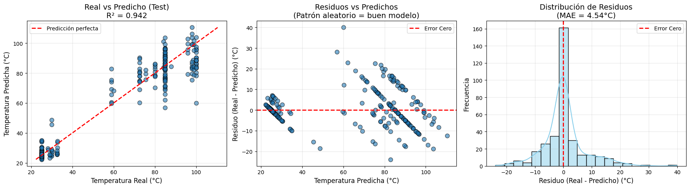

# Error Analysis

Use the tabs below to switch between English and Spanish.

=== "English"

    ## 🎯 Purpose of this Analysis

    While global metrics (RMSE, R²) tell us *how good* the model is, they do not tell us *where* it struggles. The purpose of this section is to:

    1. Verify if the errors are distributed randomly (a sign of a good model) or if there are systematic biases.

    2. Quantify the error specifically in the under-represented thermophilic range (45–80 °C), as well as in the extreme thermal niches.

    ---

    ## 📊 Error by Temperature Range (Stratified Analysis)

    To test the impact of the "Missing Middle" documented in the `Datasets` section, we evaluated the **Positional 1D-CNN** on the Test set and calculated the **Mean Absolute Error (MAE)** for three distinct thermal groups.

    | Thermal Group | Temperature Range | Number of Samples in Test | MAE (°C) |
    | :--- | :---: | :---: | :---: |
    | **Mesophiles** | < 45 °C | 193 | **1.61** |
    | **Thermophiles** | 45 – 80 °C | 25 | **8.36** |
    | **Hyperthermophiles** | ≥ 80 °C | 120 | **8.47** |

    **Analysis of the Stratified Error:**

    - **Mesophiles (< 45 °C):** The model achieves an outstanding MAE of **1.61 °C** in this well-sampled region. With 193 test samples available, the CNN successfully learned the highly conserved local motifs characteristic of mesophilic RuBisCO (mostly from plants and algae).

    - **Thermophiles (45 – 80 °C):** The MAE skyrockets to **8.36 °C**. Crucially, there are only **25 samples** in this entire test set. This is the quantitative proof of our "Missing Middle" hypothesis: **the model simply cannot generalize in this range due to severe data scarcity**. No amount of architectural complexity can compensate for the lack of examples.

    - **Hyperthermophiles (≥ 80 °C):** The MAE is also high (**8.47 °C**) despite having a larger sample size (120 samples). This suggests that predicting hyperthermophilic temperatures is inherently more difficult for the CNN. The 80–105 °C range is wider and more variable than the tight 20–35 °C mesophilic range. Furthermore, hyperthermophilic archaea often exhibit outliers in sequence length (e.g., protein fusions), which the CNN may struggle to resolve accurately.

    ---

    ## 📈 2. Residuals and Prediction Analysis (Visual Evidence)

    The following composite figure provides a visual summary of the CNN's performance on the entire Test set.

    

    **Interpretation of the panels:**

    - **Left (Real vs. Predicted):** The overall trend is clearly linear (R² = 0.942). Points are tightly clustered around the red dashed line in the mesophilic range (< 45 °C), but become significantly more scattered in the thermophilic and hyperthermophilic ranges (> 45 °C). This visual evidence directly supports the "Missing Middle" hypothesis.

    - **Middle (Residuals vs. Predicted):** For predictions below 45 °C, points are symmetrically distributed around the zero line, indicating **no systematic bias** and high stability. However, for predictions above 45 °C, the variance of the residuals increases significantly, with some errors exceeding ±20 °C. This confirms that the model's uncertainty increases dramatically in under-sampled thermal ranges.

    - **Right (Residual Distribution Histogram):** The histogram is approximately **normal and centered at zero** (MAE = 4.54 °C), indicating the model is globally unbiased. However, the "tails" are wider than a perfect distribution, reflecting the large residuals observed in the thermophilic and hyperthermophilic predictions.

    ---

    ## 🔍 Conclusion of Error Analysis

    The error analysis confirms the fundamental limitation of the current dataset:
    1. The model performs exceptionally well in the **mesophilic range (< 45 °C)**, achieving an MAE of just 1.6 °C.

    2. The **"Missing Middle" (Thermophiles, 45–80 °C)** is a real, quantifiable bottleneck, with an MAE of 8.36 °C driven by a dramatic lack of training samples (only 25 in the test set).

    3. The model performs moderately in the **hyperthermophilic range (>80 °C)**. While the sample size is larger, the inherent variability in sequence structure of hyperthermophilic archaea prevents the model from reaching the same accuracy as the mesophilic predictions.

    This diagnosis sets a clear direction for future work: **improving the model's performance requires acquiring more experimental data in the 45–80 °C range**, and potentially incorporating structural embeddings (like AlphaFold) to help the CNN better resolve the complex patterns found in hyperthermophilic sequences.

=== "Español"

    ## 🎯 Propósito de este análisis

    Si bien las métricas globales (RMSE, R²) nos dicen *lo bueno* que es el modelo, no nos dicen *dónde* falla. El propósito de esta sección es:

    1. Verificar si los errores se distribuyen aleatoriamente (señal de un buen modelo) o si existen sesgos sistemáticos.

    2. Cuantificar el error específicamente en el rango termófilo infrarrepresentado (45–80 °C), así como en los nichos térmicos extremos.

    ---

    ## 📊 Error por rango de temperatura (Análisis estratificado)

    Para probar el impacto del "Missing Middle" documentado en la sección `Datasets`, evaluamos la **CNN Posicional 1D** sobre el conjunto de Test y calculamos el **Error Absoluto Medio (MAE)** para tres grupos térmicos distintos.

    | Grupo Térmico | Rango de Temperatura | Número de muestras en Test | MAE (°C) |
    | :--- | :---: | :---: | :---: |
    | **Mesófilos** | < 45 °C | 193 | **1.61** |
    | **Termófilos** | 45 – 80 °C | 25 | **8.36** |
    | **Hipertermófilos** | ≥ 80 °C | 120 | **8.47** |

    **Análisis del error estratificado:**

    - **Mesófilos (< 45 °C):** El modelo logra un MAE excepcional de **1.61 °C** en esta región bien muestreada. Con 193 muestras de test disponibles, la CNN aprendió con éxito los motivos locales altamente conservados característicos de la RuBisCO mesófila (principalmente de plantas y algas).

    - **Termófilos (45 – 80 °C):** El MAE se dispara hasta los **8.36 °C**. De forma crucial, solo hay **25 muestras** en todo este conjunto de test. Esta es la prueba cuantitativa de nuestra hipótesis del "Missing Middle": **el modelo simplemente no puede generalizar en este rango debido a la grave escasez de datos**. Ninguna complejidad arquitectónica puede compensar la falta de ejemplos.

    - **Hipertermófilos (≥ 80 °C):** El MAE también es alto (**8.47 °C**) a pesar de tener un tamaño de muestra mayor (120 muestras). Esto sugiere que predecir temperaturas hipertermófilas es inherentemente más difícil para la CNN. El rango de 80–105 °C es más amplio y variable que el estrecho rango mesófilo de 20–35 °C. Además, las arqueas hipertermófilas suelen presentar valores atípicos en la longitud de la secuencia (por ejemplo, fusiones de proteínas), que la CNN puede tener dificultades para resolver con precisión.

    ---

    ## 📈 2. Análisis de residuos y predicciones (Evidencia visual)

    La siguiente figura compuesta proporciona un resumen visual del rendimiento de la CNN en todo el conjunto de Test.

    

    **Interpretación de los paneles:**

    - **Izquierdo (Real vs. Predicho):** La tendencia general es claramente lineal (R² = 0.942). Los puntos están estrechamente agrupados alrededor de la línea roja discontinua en el rango mesófilo (< 45 °C), pero se vuelven significativamente más dispersos en los rangos termófilo e hipertermófilo (> 45 °C). Esta evidencia visual respalda directamente la hipótesis del "Missing Middle".

    - **Central (Residuos vs. Predichos):** Para predicciones por debajo de 45 °C, los puntos están distribuidos simétricamente alrededor de la línea cero, lo que indica **ningún sesgo sistemático** y alta estabilidad. Sin embargo, para predicciones por encima de 45 °C, la varianza de los residuos aumenta significativamente, con algunos errores superando los ±20 °C. Esto confirma que la incertidumbre del modelo aumenta drásticamente en los rangos térmicos con menos muestras.

    - **Derecho (Histograma de residuos):** El histograma es aproximadamente **normal y centrado en cero** (MAE = 4.54 °C), lo que indica que el modelo es globalmente insesgado. Sin embargo, las "colas" son más anchas que una distribución perfecta, reflejando los grandes residuos observados en las predicciones termófilas e hipertermófilas.

    ---

    ## 🔍 Conclusión del análisis de errores

    El análisis de errores confirma la limitación fundamental del dataset actual:

    1. El modelo se desempeña excepcionalmente bien en el **rango mesófilo (< 45 °C)**, logrando un MAE de solo 1.6 °C.

    2. El **"Missing Middle" (Termófilos, 45–80 °C)** es un cuello de botella real y cuantificable, con un MAE de 8.36 °C impulsado por una dramática falta de muestras de entrenamiento (solo 25 en el conjunto de test).

    3. El modelo se desempeña de forma moderada en el **rango hipertermófilo (>80 °C)**. Aunque el tamaño de la muestra es mayor, la variabilidad inherente en la estructura de la secuencia de las arqueas hipertermófilas impide que el modelo alcance la misma precisión que las predicciones mesófilas.

    Este diagnóstico establece una dirección clara para el trabajo futuro: **mejorar el rendimiento del modelo requiere adquirir más datos experimentales en el rango de 45–80 °C**, y potencialmente incorporar embeddings estructurales (como AlphaFold) para ayudar a la CNN a resolver mejor los patrones complejos encontrados en las secuencias hipertermófilas.