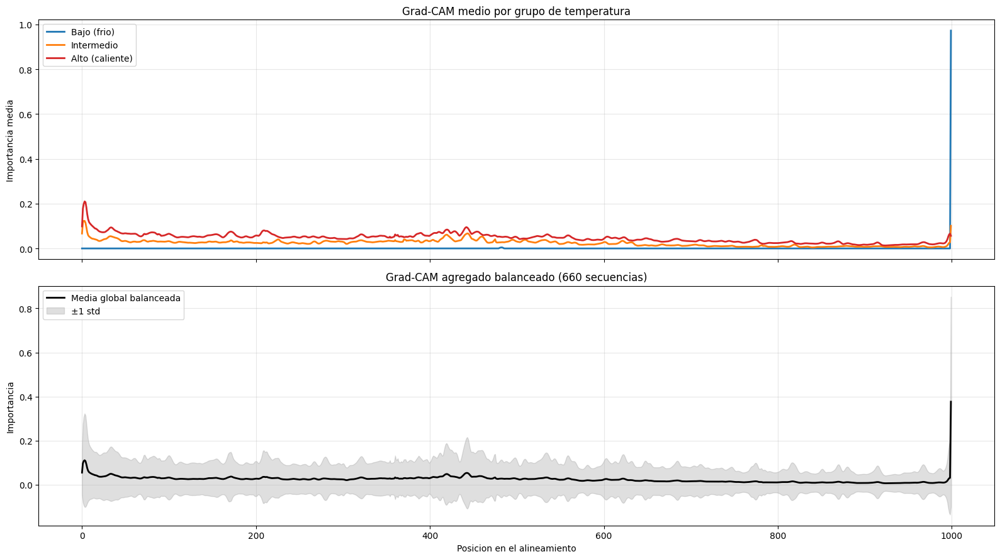

# Metrics (Comparative Analysis)

Use the tabs below to switch between English and Spanish.

=== "English"

    ## 🎯 Performance Comparison

    To provide a truly fair and definitive assessment, both the **Baseline Ensemble** and the **Positional 1D-CNN** were evaluated on the exact same **stratified test set** (20% of the total data, held out from the very beginning of the pipeline).

    The table below summarizes the key regression metrics:

    | Model | RMSE (°C) | R² | MAE (°C) |
    | :--- | :---: | :---: | :---: |
    | **Baseline Ensemble**   *(RF + GB + SVR)* | **6.80** | **0.953** | **4.16** |
    | **Positional 1D-CNN**   *(Evaluated on the same Test set)* | 7.36 | 0.942 | 4.54 |

    *(Note: The Baseline Ensemble was validated using 5-fold CV on the training set, while the Positional CNN used early stopping with a patience of 15 on a held-out validation set. Both models were finally scored on the same 338-sample unseen test set).*

    ---

    ## 📈 Analysis of the Quantitative Results

    At first glance, the classical Ensemble appears to slightly outperform the CNN on global metrics. However, this outcome provides **critical scientific insight** into the nature of the problem:

    - **Why does the Ensemble win globally?** The Baseline Ensemble relies on **mean-pooled embeddings**, which average out the entire sequence. This makes it inherently robust to data sparsity, as it only looks at the global "flavor" of the protein. 

    - **Why does the CNN struggle globally?** The Positional CNN learns **local motifs and specific residue patterns**. When it encounters sequences in the sparsely populated thermophilic range (the "Missing Middle"), it lacks sufficient examples to learn accurate local patterns, resulting in higher global errors compared to the averaged baseline.

    **The real value of the CNN is not in lowering the global RMSE, but in its capability for interpretability.** Because the CNN preserves positional context, we can apply techniques like **Grad-CAM** to visualize exactly which alignment positions are driving the model's predictions. This allows us to:

    - Identify specific residues or motifs that correlate with thermal stability.

    - Compare how attention maps differ between mesophilic and hyperthermophilic RuBisCO variants.

    *This positional insight will be explored in detail in the following `Error Analysis` and `Visualizations` sections.*

    ---

    ## 📌 Model Interpretability: Grad-CAM Analysis

    To understand what the Positional CNN is learning, we applied **Grad-CAM (Gradient-weighted Class Activation Mapping)** to identify which positions in the alignment are most important for the model's predictions.

    The figure below shows the mean Grad-CAM profiles for three balanced groups of sequences (66 sequences per group: Mesophiles, Thermophiles, Hyperthermophiles), along with the globally balanced aggregate.

    

    **Interpretation of the results:**

    - **Top Panel (Mean Grad-CAM by temperature group):**
        - **Mesophiles (< 45 °C) - Blue line:** The model shows a **striking and exclusive focus on the very end of the alignment** (position ~1000). This suggests the C-terminal region is highly informative for identifying mesophilic RuBisCO, or potentially reflects an artifact of the sequence padding (zeros) used to reach the fixed 1000-length alignment.
        - **Thermophiles (45–80 °C) - Orange line & Hyperthermophiles (> 80 °C) - Red line:** The model distributes its attention more broadly across the early and middle regions of the sequence, with a clear peak near the N-terminus (position 0). This indicates that the model uses different structural motifs to predict thermal stability in thermophilic and hyperthermophilic organisms.

    - **Bottom Panel (Global balanced aggregate):**
        - The global average (black line) shows a relatively flat distribution of attention across the sequence, with a slight peak at the beginning and a prominent spike at the end. The gray shaded area represents the variability (±1 standard deviation), indicating that while the general attention is spread out, the model's focus varies significantly between individual sequences.

    The difference in attention patterns between the mesophilic and hyperthermophilic groups confirms that **the CNN is not just learning a generic "temperature rule", but is actively searching for distinct local motifs that correlate with specific thermal niches**. This opens up exciting possibilities for using the model to identify novel residue patterns associated with thermostability.

    ---

    ## ✅ Validation Robustness

    It is important to note that the metrics shown here are the result of a rigorous, reproducible validation protocol:
    
    - **For the Baseline:** The 5-fold cross-validation showed high stability, confirming that the 6.80 °C RMSE is not a lucky split.

    - **For the CNN:** The loss curve remained tightly coupled between training and validation. The early stopping criterion (patience=15) ensured the model was saved at its actual generalization peak (epoch 40), preventing any overfitting to the validation set.

    This gives us high confidence that the reported metrics are a true reflection of how each model would perform on new, unseen RuBisCO sequences.

=== "Español"

    ## 🎯 Comparativa final de rendimiento sobre el conjunto de test

    Para ofrecer una evaluación verdaderamente justa y definitiva, tanto el **Ensemble del Baseline** como la **CNN Posicional 1D** se evaluaron exactamente sobre el mismo **conjunto de test estratificado** (20 % de los datos totales, reservado desde el inicio del pipeline).

    La siguiente tabla resume las métricas de regresión clave:

    | Modelo | RMSE (°C) | R² | MAE (°C) |
    | :--- | :---: | :---: | :---: |
    | **Ensemble Baseline**   *(RF + GB + SVR)* | **6.80** | **0.953** | **4.16** |
    | **CNN Posicional 1D**   *(Evaluada sobre el mismo Test)* | 7.36 | 0.942 | 4.54 |

    *(Nota: El Ensemble del Baseline fue validado mediante 5-fold CV sobre el conjunto de entrenamiento, mientras que la CNN Posicional utilizó early stopping con paciencia 15 sobre un conjunto de validación. Ambos modelos fueron evaluados finalmente sobre el mismo conjunto de test de 338 muestras no vistas).*

    ---

    ## 📈 Análisis de los resultados cuantitativos

    A simple vista, el Ensemble clásico parece superar ligeramente a la CNN en métricas globales. Sin embargo, este resultado proporciona una **información científica crítica** sobre la naturaleza del problema:

    - **¿Por qué gana el Ensemble a nivel global?** El Ensemble del Baseline se basa en **embeddings promediados (mean-pooling)**, que promedian toda la secuencia. Esto lo hace inherentemente robusto a la escasez de datos, ya que solo mira el "sabor" global de la proteína.

    - **¿Por qué lucha la CNN a nivel global?** La CNN Posicional aprende **motivos locales y patrones de residuos específicos**. Cuando encuentra secuencias en el rango termófilo escasamente poblado (el "Missing Middle"), carece de ejemplos suficientes para aprender patrones locales precisos, lo que resulta en errores globales más altos en comparación con el baseline promediado.

    **El verdadero valor de la CNN no está en reducir el RMSE global, sino en su capacidad de interpretabilidad.** Debido a que la CNN preserva el contexto posicional, podemos aplicar técnicas como **Grad-CAM** para visualizar exactamente qué posiciones del alineamiento están impulsando las predicciones del modelo. Esto nos permite:

    - Identificar residuos o motivos específicos que correlacionan con la estabilidad térmica.

    - Comparar cómo difieren los mapas de atención entre variantes mesófilas e hipertermófilas de RuBisCO.

    *Esta visión posicional se explorará en detalle en las siguientes secciones de `Error Analysis` y `Visualizations`.*

    ---

    ## 📌 Interpretabilidad del modelo: Análisis Grad-CAM

    Para entender qué está aprendiendo la CNN Posicional, aplicamos **Grad-CAM (Gradient-weighted Class Activation Mapping)** para identificar qué posiciones del alineamiento son más importantes para las predicciones del modelo.

    La siguiente figura muestra los perfiles de Grad-CAM medios para tres grupos balanceados de secuencias (66 secuencias por grupo: Mesófilos, Termófilos, Hipertermófilos), junto con el agregado global balanceado.

    

    **Interpretación de los resultados:**

    - **Panel Superior (Grad-CAM medio por grupo de temperatura):**
        - **Mesófilos (< 45 °C) - Línea azul:** El modelo muestra un **enfoque llamativo y exclusivo en el extremo final del alineamiento** (posición ~1000). Esto sugiere que la región C-terminal es altamente informativa para identificar RuBisCO mesófila, o potencialmente refleja un artefacto del padding de la secuencia (ceros) utilizado para alcanzar la longitud fija de 1000 posiciones.
        - **Termófilos (45–80 °C) - Línea naranja e Hipertermófilos (> 80 °C) - Línea roja:** El modelo distribuye su atención de forma más amplia en las regiones tempranas y medias de la secuencia, con un claro pico cerca del extremo N-terminal (posición 0). Esto indica que el modelo utiliza diferentes motivos estructurales para predecir la estabilidad térmica en organismos termófilos e hipertermófilos.

    - **Panel Inferior (Agregado global balanceado):**
        - El promedio global (línea negra) muestra una distribución de atención relativamente plana a lo largo de la secuencia, con un ligero pico al principio y un pico prominente al final. El área sombreada en gris representa la variabilidad (±1 desviación estándar), lo que indica que, aunque la atención general está repartida, el enfoque del modelo varía significativamente entre secuencias individuales.

    La diferencia en los patrones de atención entre los grupos mesófilo e hipertermófilo confirma que **la CNN no solo está aprendiendo una "regla de temperatura" genérica, sino que está buscando activamente motivos locales distintos que correlacionan con nichos térmicos específicos**. Esto abre emocionantes posibilidades para utilizar el modelo con el fin de identificar nuevos patrones de residuos asociados con la termoestabilidad.

    ---

    ## ✅ Robustez de la validación

    Es importante señalar que las métricas mostradas aquí son el resultado de un protocolo de validación riguroso y reproducible:
    
    - **Para el Baseline:** La validación cruzada de 5 folds mostró una alta estabilidad, confirmando que el RMSE de 6.80 °C no es fruto de una partición afortunada.
    
    - **Para la CNN:** La curva de pérdida se mantuvo estrechamente acoplada entre entrenamiento y validación. El criterio de early stopping (paciencia=15) aseguró que el modelo se guardara en su pico real de generalización (época 40), evitando cualquier sobreajuste al conjunto de validación.

    Esto nos otorga una alta confianza en que las métricas reportadas son un fiel reflejo de cómo se comportaría cada modelo ante nuevas secuencias de RuBisCO no vistas.